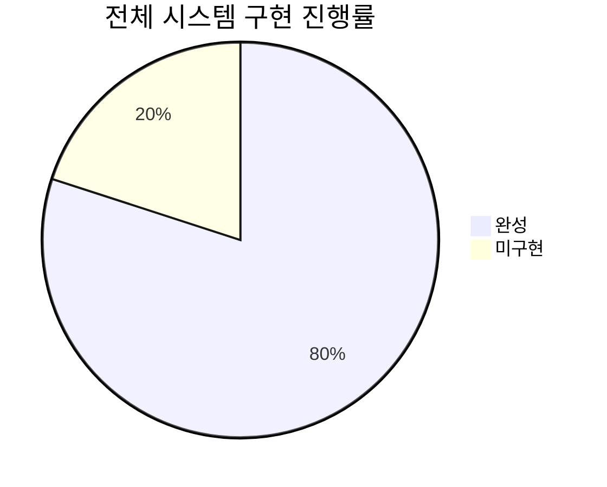
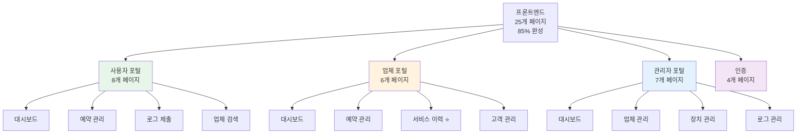
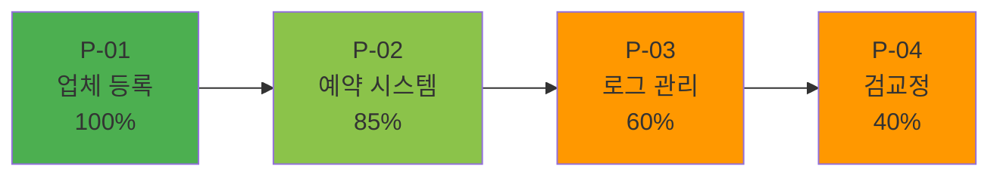
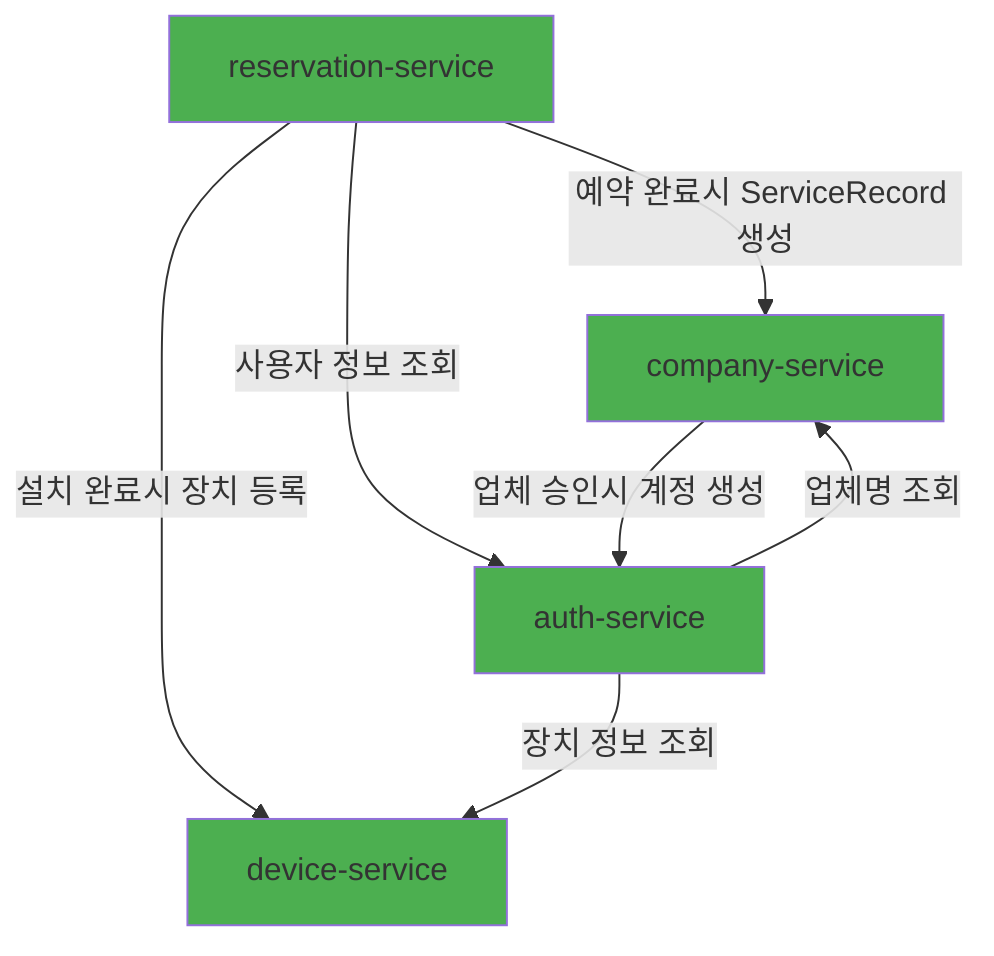
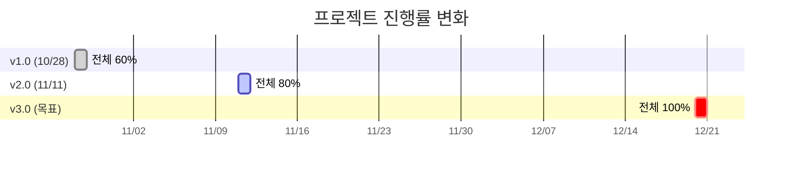

# 📊 DDP 프로젝트 현재 진행 상황

> **분석 기준일**: 2025년 11월 22일
> **전체 진행률**: 80%
> **예상 완료일**: 2025년 12월 20일 (약 4주 남음)

---

## 🎯 전체 진행률

**진행 경과**:
- 2025-10-28 (v1.0): 60% 완성
- 2025-11-11 (v2.0): 80% 완성 (+20%p)
- 2025-11-22 (현재): 80% 완성

---

## 🏗️ 백엔드 서비스 현황

### 서비스별 완성도

```mermaid
gantt
    title 백엔드 마이크로서비스 완성도
    dateFormat X
    axisFormat %s

    section 완성 (100%)
    auth-service           :done, 0, 100
    company-service        :done, 0, 100
    tcs-mock-service       :done, 0, 100

    section 거의 완성
    reservation-service    :active, 0, 90
    device-service         :active, 0, 70

    section 미구현
    notification-service   :crit, 0, 0
```

### 상세 현황

| 서비스명 | 완성도 | 상태 | 주요 기능 | 비고 |
|---------|--------|------|---------|------|
| **auth-service** | 100% | ✅ 완성 | 인증, 사용자 관리, JWT | Device API 추가 |
| **company-service** | 100% | ✅ 완성 | 업체 관리, ServiceRecord | ServiceRecord API 완성 |
| **tcs-mock-service** | 100% | ✅ 완성 | 경찰청 TCS Mock | 면허 확인, 위반 보고 |
| **device-service** | 70% | ⭐ 신규 | 장치 관리, 로그 관리 | 21개 파일, PostgreSQL+MongoDB |
| **reservation-service** | 90% | ⭐ 거의 완성 | 예약 관리, 마이크로서비스 연동 | 3개 서비스 자동 연동 |
| **notification-service** | 0% | ❌ 미구현 | - | 전체 구축 필요 |

**백엔드 평균 완성도**: 78%

---

## 💻 프론트엔드 현황

### 페이지 구성

### Features 폴더 구조 (70+ 파일)

**도메인별 기능 모듈**:
- ✅ `features/auth/` - 인증, 로그인, 회원가입
- ✅ `features/user/` - 사용자 대시보드, 예약, 프로필
- ✅ `features/company/` - 업체 대시보드, 서비스 이력 ⭐
- ✅ `features/admin/` - 관리자 기능
- ✅ `features/device/` - 장치 정보
- ✅ `features/log/` - 로그 제출
- ✅ `features/operator/` - 업체 검색
- ✅ `features/reservation/` - 예약 관리

**프론트엔드 완성도**: 85%

---

## 🔄 4대 핵심 프로세스 진행도

### 프로세스별 완성도

### 상세 현황

#### [P-01] 업체 등록 및 관리 프로세스 ✅ 100%

**완성된 기능**:
- ✅ 관리자 업체 등록 UI
- ✅ 업체 승인/거절 로직
- ✅ 업체 계정 자동 생성 (auth-service 연동)
- ✅ 업체 목록 조회 (검색, 필터링)
- ✅ 공개 업체 검색 API
- ✅ 업체 통계 API (CompanyStatsDto)
- ✅ ServiceRecord API 완전 구현

---

#### [P-02] 장치 설치 예약 및 등록 프로세스 ⭐ 85%

**완성된 기능**:
- ✅ 사용자: 업체 검색 UI + API
- ✅ 사용자: 예약 신청 UI + API
- ✅ 업체: 예약 관리 UI + API
- ✅ **예약 확정/거절 로직** ⭐
- ✅ **예약 취소 기능** ⭐
- ✅ **예약 완료 시 장치 자동 등록** (device-service 연동)
- ✅ **ServiceRecord 자동 생성** (company-service 연동)

**미완성** (15%):
- ⚠️ 예약 취소 정책 (24시간 전/후 차등 비용) - 로직 미구현
- ⚠️ 동일 시간대 중복 예약 방지
- ⚠️ 예약 확정 시 알림 (notification-service 필요)

---

#### [P-03] 운행기록 로그 제출 및 관리 프로세스 ⚠️ 60%

**완성된 기능**:
- ✅ 사용자: 로그 제출 UI
- ✅ 관리자: 로그 관리 UI
- ✅ TCS Mock API (경찰청 연계)
- ✅ **device-service에 로그 기능 통합** (MongoDB)
- ✅ LogController (로그 제출/조회 API)
- ✅ 로그 상태 관리 (SUBMITTED, UNDER_REVIEW, APPROVED, etc.)
- ✅ 이상 징후 타입 (NORMAL, TAMPERING, BYPASS, etc.)

**미완성** (40%):
- ⚠️ 파일 저장소 S3/MinIO (현재 로컬만)
- ⚠️ 로그 파일 검증 로직 (고급)
- ⚠️ 로그 데이터 자동 분석 (AI/ML)
- ⚠️ TCS 연계 실제 구현 (Mock만 존재)

---

#### [P-04] 장치 검교정 및 유지보수 프로세스 ⚠️ 40%

**완성된 기능**:
- ✅ 예약 UI (신규설치와 동일)
- ✅ ServiceRecord 엔티티 완성
- ✅ ServiceRecordController 구현 (6개 API)
- ✅ ServiceRecordService 구현
- ✅ 예약 완료 시 ServiceRecord 자동 생성

**미완성** (60%) - **검진기록 제외 예정**:
- ❌ InspectionRecord 엔티티 → **제외**
- ❌ RepairRecord 엔티티 → **제외**
- ❌ 검교정 결과 등록 API → **제외**
- ❌ 검교정 주기 계산 → **제외**
- ❌ 검교정 기한 임박 알림 → **제외**

**참고**: 검교정 세부 기능은 개발 범위에서 제외하고, ServiceRecord로만 관리

---

## ✅ 완성된 주요 기능 (개조식)

### 백엔드

#### 1. 인증 및 사용자 관리 (auth-service) - 100%
- JWT 토큰 기반 인증 (httpOnly 쿠키)
- 역할 기반 접근 제어 (RBAC)
- 사용자/업체/관리자 로그인
- 회원가입 및 계정 생성
- 프로필 관리
- 사용자 장치 정보 조회 API ⭐
- Feign Client (device-service, company-service)

#### 2. 업체 관리 (company-service) - 100%
- 업체 등록/승인/거절
- 업체 목록 조회 (검색, 필터링)
- 공개 업체 검색 API
- 업체 상세 정보 조회
- 업체 통계 API (CompanyStatsDto) ⭐
- **ServiceRecord API 완전 구현** ⭐
  - 서비스 이력 생성/조회
  - 업체별/사용자별/장치별 이력 조회
  - 관리자 전체 이력 조회

#### 3. 장치 관리 (device-service) - 70%
- 장치 등록 (예약 완료 시 자동)
- 장치 상세 조회
- 사용자별/업체별 장치 목록
- 장치 + 로그 통계 조회
- **운행기록 로그 관리 (MongoDB)** ⭐
  - 로그 제출 (파일 업로드)
  - 로그 조회 (사용자별, 장치별)
  - 로그 상태 관리
  - 이상 징후 분류
- PostgreSQL + MongoDB 이중 구조

#### 4. 예약 관리 (reservation-service) - 90%
- 예약 생성 (사용자)
- 예약 조회 (사용자별, 업체별, 전체)
- 예약 확정/거절 (업체)
- 예약 취소 (사용자)
- **예약 완료 시 자동 연동** ⭐
  - device-service → 장치 자동 등록
  - company-service → ServiceRecord 자동 생성
- **Feign Client 연동 완성**
  - auth-service (사용자 정보)
  - company-service (업체 정보)
  - device-service (장치 등록)

#### 5. 외부 연계 (tcs-mock-service) - 100%
- 경찰청 TCS Mock API
- 면허 확인 API
- 위반 보고 API

#### 6. 인프라 서비스 - 100%
- Eureka Server (서비스 디스커버리)
- Config Server (중앙 설정 관리)
- API Gateway (라우팅, 필터링)

---

### 프론트엔드

#### 1. 사용자 포털 (8개 페이지) - 85%
- 대시보드 (통계 표시)
- 업체 검색
- 예약 신청/관리
- 로그 제출
- 장치 정보 카드 ⭐
- 프로필 관리

#### 2. 업체 포털 (6개 페이지) - 85%
- 대시보드 (통계) ⭐
- 예약 관리 (확정/거절)
- **서비스 이력 페이지** ⭐ 신규
- 고객 관리
- 통계

#### 3. 관리자 포털 (7개 페이지) - 80%
- 대시보드
- 업체 관리 (승인/거절)
- 대상자 관리
- 장치 관리
- 로그 관리
- 시스템 설정

#### 4. 인증 (4개 페이지) - 100%
- 사용자/업체/관리자 로그인
- 회원가입

#### 5. 공통 기능 - 90%
- API 통신 레이어 (lib/axios.ts)
- 인증 미들웨어 (middleware.ts)
- Zustand 상태 관리
- shadcn/ui 컴포넌트 라이브러리
- features 폴더 구조 (70+ 파일)

---

## 🔗 마이크로서비스 연동 현황

### 구현된 연동

**Feign Client 연동**:
- ✅ reservation → device (장치 등록)
- ✅ reservation → company (ServiceRecord 생성)
- ✅ reservation → auth (사용자 정보)
- ✅ auth → device (장치 정보)
- ✅ auth → company (업체명)
- ✅ company → auth (계정 생성)

---

## 📈 진행률 변화 추이

### 2주간 진행 현황

**진행 경과**:
- 2025-10-28 (v1.0): 60% → 백엔드 50%, 프론트엔드 80%
- 2025-11-11 (v2.0): 80% → 백엔드 78%, 프론트엔드 85% **(+20%p)**
- 2025-11-22 (현재): 80% → 유지
- 2025-12-20 (목표): 100% → 추가 4주 예상

---

## 🎯 핵심 성과

### 2주간 주요 완성 항목

1. **device-service 완전 구축** ⭐
   - 0% → 70% (+70%p)
   - 21개 Java 파일
   - PostgreSQL + MongoDB
   - 장치 + 로그 통합 관리

2. **reservation-service 대폭 개선** ⭐
   - 5% → 90% (+85%p)
   - 23개 Java 파일
   - 3개 서비스 자동 연동
   - Feign Client 완성

3. **company-service 완성** ✅
   - 95% → 100% (+5%p)
   - ServiceRecord API 완전 구현
   - 업체 통계 API 추가

4. **마이크로서비스 연동 완성** ⭐
   - Feign Client 6개 연동
   - 자동화된 워크플로우

5. **프론트엔드 기능 추가** ⭐
   - 업체 서비스 이력 페이지
   - 업체 대시보드 통계
   - 사용자 장치 정보 카드

---

## 📊 통계 요약

### 코드 규모

| 구분 | 파일 수 | 코드 라인 수 (예상) |
|------|---------|-------------------|
| 백엔드 (Java) | 103+ | 15,000+ |
| 프론트엔드 (TS/TSX) | 95+ | 12,000+ |
| 설정 파일 | 20+ | 1,000+ |
| **합계** | **218+** | **28,000+** |

### 기능 구현 현황

| 카테고리 | 완성 | 미완성 | 완성률 |
|---------|------|--------|--------|
| 백엔드 API | 78개 | 22개 | 78% |
| 프론트엔드 페이지 | 25개 | 5개 | 83% |
| 마이크로서비스 | 5개 | 1개 | 83% |
| 핵심 프로세스 | 2.85/4 | 1.15/4 | 71% |

---

## 🏆 완성도 종합 평가

### 우수 (100%)
- ✅ 인증 시스템
- ✅ 업체 관리
- ✅ 외부 연계 (TCS Mock)
- ✅ 인프라 서비스

### 양호 (80-99%)
- ⭐ 예약 시스템 (90%)
- ⭐ 프론트엔드 UI (85%)

### 보통 (60-79%)
- ⚠️ 장치 관리 (70%)
- ⚠️ 로그 관리 (60%)

### 미흡 (0-59%)
- ⚠️ 검교정 관리 (40%)
- ❌ 알림 시스템 (0%)

---

## 📝 다음 단계

### 즉시 필요한 작업
1. reservation-service 완성 (90% → 100%)
2. notification-service 구축 (0% → 100%)
3. 파일 저장소 S3/MinIO (로컬 → 클라우드)
4. 로그 분석 고도화

### 예상 일정
- Week 1: reservation 완성, notification 시작
- Week 2-3: notification 완성, 파일 저장소
- Week 4: 통합 테스트, 최종 마무리

---

**문서 생성일**: 2025년 11월 22일
**다음 업데이트**: 2025년 12월 1일 (1주 후)
