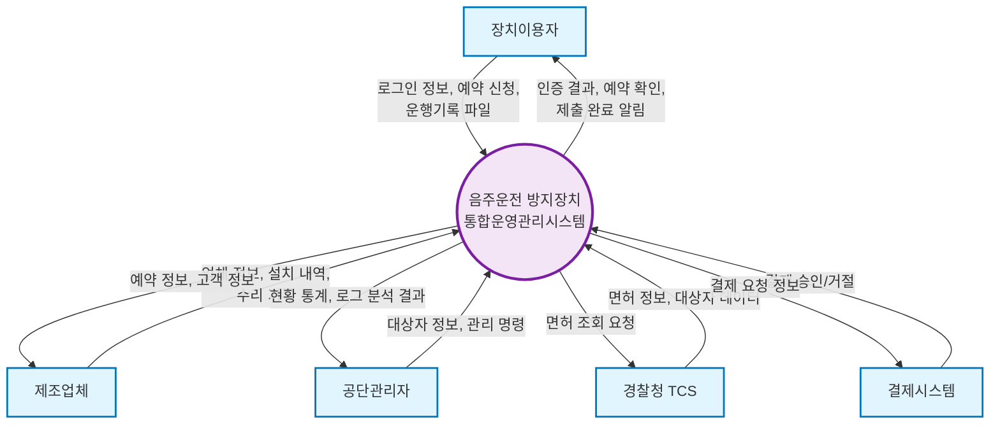
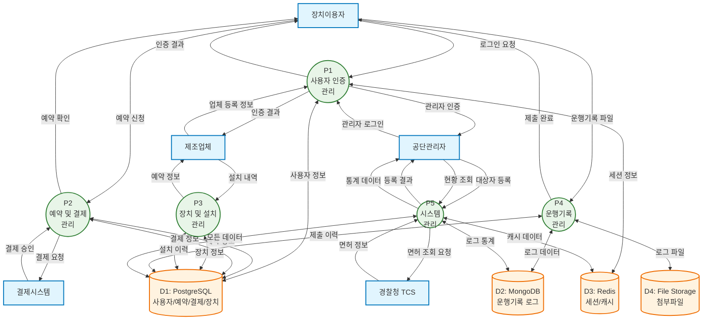
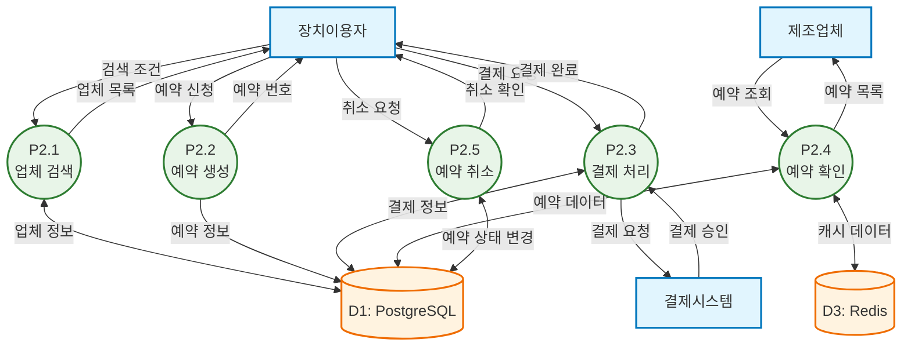
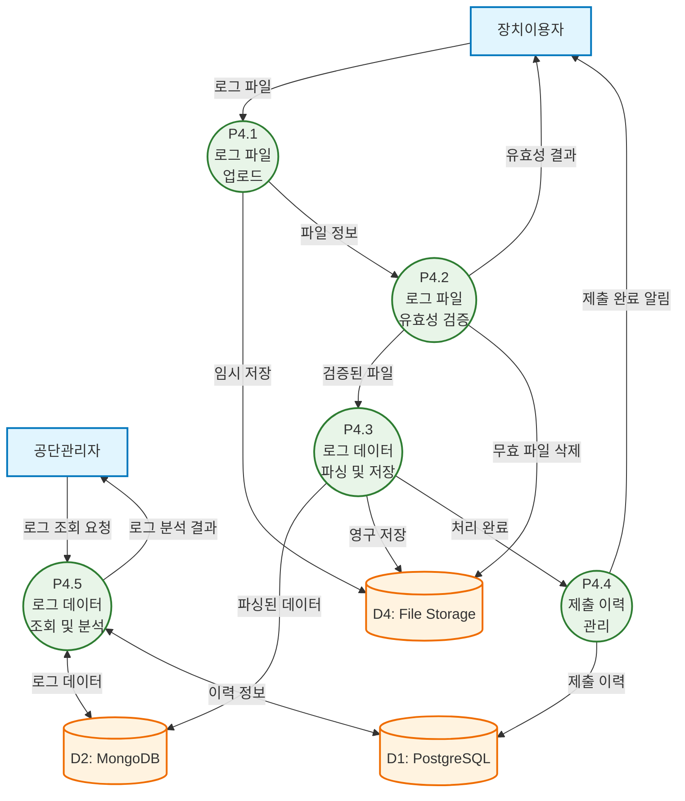
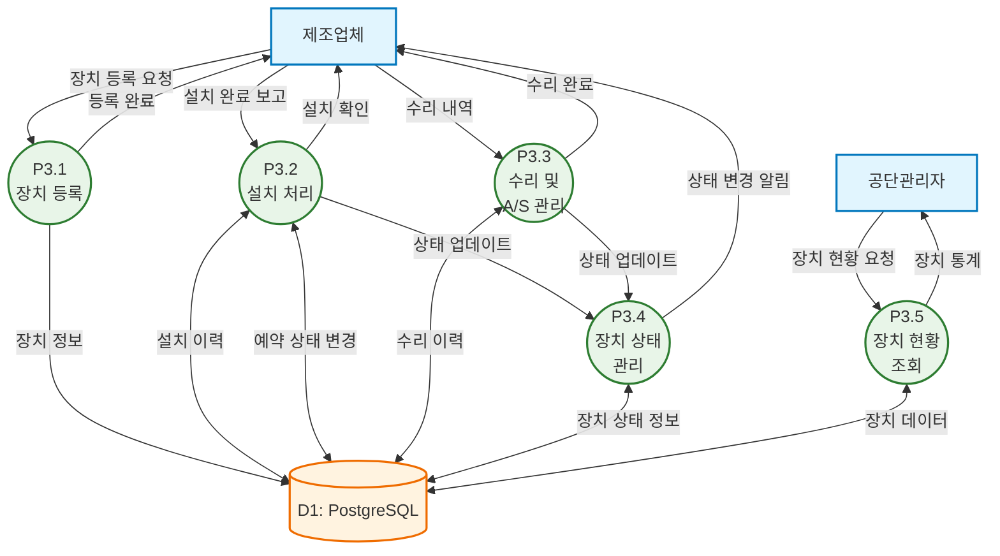

# 음주운전 방지장치 통합운영관리시스템 Data Flow Diagram (DFD)

본 문서는 음주운전 방지장치 통합운영관리시스템의 데이터 흐름을 DFD로 표현합니다.

## DFD 표기법

- **원형/타원**: 프로세스 (Process)
- **사각형**: 외부 엔티티 (External Entity)  
- **평행선**: 데이터 저장소 (Data Store)
- **화살표**: 데이터 흐름 (Data Flow)

---

## Context Diagram (Level -1)

전체 시스템과 외부 엔티티 간의 데이터 흐름을 나타냅니다.

---

## Level 0 DFD

시스템의 주요 프로세스들과 데이터 저장소를 나타냅니다.

---

## Level 1 DFD - 예약 및 결제 관리 프로세스 (P2)

---

## Level 1 DFD - 운행기록 관리 프로세스 (P4)

---

## Level 1 DFD - 장치 및 설치 관리 프로세스 (P3)

---

## 데이터 저장소 상세

### D1: PostgreSQL (관계형 데이터베이스)
- **사용자 정보**: 이용자, 업체, 관리자 계정
- **예약 정보**: 설치/수리 예약, 상태, 일정
- **결제 정보**: 결제 내역, 상태, 금액
- **장치 정보**: 장치 등록, 설치 이력, 상태
- **제출 이력**: 로그 제출 기록, 처리 상태

### D2: MongoDB (문서형 데이터베이스)
- **운행기록 데이터**: 대용량 로그 파일의 JSON 형태 저장
- **분석 데이터**: 집계된 통계 정보
- **이벤트 로그**: 시스템 사용 로그

### D3: Redis (인메모리 캐시)
- **세션 정보**: 사용자 로그인 상태
- **임시 데이터**: API 응답 캐시
- **통계 캐시**: 대시보드용 집계 데이터

### D4: File Storage (파일 저장소)
- **원본 로그 파일**: 사용자가 업로드한 파일
- **첨부파일**: 증명서류, 이미지 등
- **백업 파일**: 시스템 백업 데이터

---

## DFD 작성 원칙 및 고려사항

1. **데이터 흐름의 방향성**: 모든 데이터 흐름은 명확한 방향을 가집니다
2. **프로세스 분해**: 복잡한 프로세스는 Level 1에서 세부 프로세스로 분해됩니다
3. **데이터 저장소 최적화**: 데이터 특성에 따라 적절한 저장소를 선택합니다
4. **외부 시스템 연동**: 경찰청 TCS, 결제 시스템 등 외부 연동을 명시합니다
5. **보안 고려**: 민감한 개인정보는 암호화하여 저장합니다