# 음주운전 방지장치 통합운영관리시스템 프로세스 정의서

## 1. 시스템 개요

**프로젝트명**: 음주운전 방지장치 통합운영관리시스템 구축 사업

**문서 목적**: 시스템의 3대 주요 행위자(관리자, 업체, 사용자) 간의 상호작용 및 핵심 업무 절차를 시각화

### 주요 행위자 (Actors)

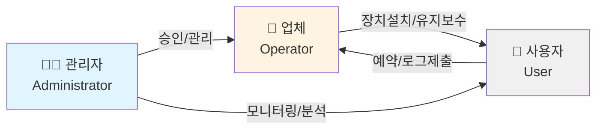
```mermaid
graph LR
    A[👨‍💼 관리자<br/>Administrator]
    B[🏢 업체<br/>Operator]
    C[👤 사용자<br/>User]

    A -->|승인/관리| B
    B -->|장치설치/유지보수| C
    C -->|예약/로그제출| B
    A -->|모니터링/분석| C

    style A fill:#e1f5ff
    style B fill:#fff4e1
    style C fill:#f0f0f0
```

- **관리자**: 도로교통공단 소속, 시스템 총괄 운영자
- **업체**: 공단 인증을 받은 장치 제조·설치·수리 담당자
- **사용자**: 음주운전 방지장치 부착 의무가 있는 운전자

---

## 2. 핵심 프로세스

### [P-01] 업체 등록 및 관리 프로세스

**목적**: 관리자가 신뢰할 수 있는 업체를 시스템에 등록, 승인, 관리

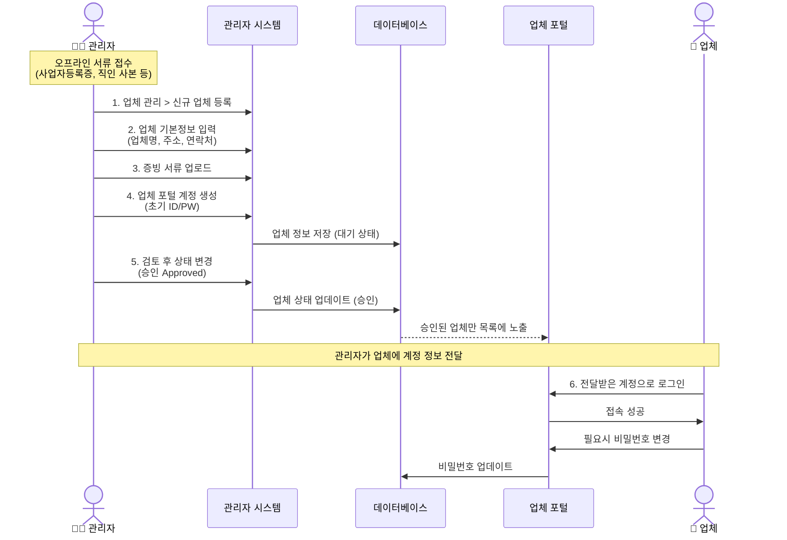
```mermaid
sequenceDiagram
    actor Admin as 👨‍💼 관리자
    participant AdminSys as 관리자 시스템
    participant DB as 데이터베이스
    participant Portal as 업체 포털
    actor Operator as 🏢 업체

    Note over Admin: 오프라인 서류 접수<br/>(사업자등록증, 직인 사본 등)

    Admin->>AdminSys: 1. 업체 관리 > 신규 업체 등록
    Admin->>AdminSys: 2. 업체 기본정보 입력<br/>(업체명, 주소, 연락처)
    Admin->>AdminSys: 3. 증빙 서류 업로드
    Admin->>AdminSys: 4. 업체 포털 계정 생성<br/>(초기 ID/PW)
    AdminSys->>DB: 업체 정보 저장 (대기 상태)

    Admin->>AdminSys: 5. 검토 후 상태 변경<br/>(승인 Approved)
    AdminSys->>DB: 업체 상태 업데이트 (승인)

    DB-->>Portal: 승인된 업체만 목록에 노출

    Note over Admin,Operator: 관리자가 업체에 계정 정보 전달

    Operator->>Portal: 6. 전달받은 계정으로 로그인
    Portal->>Operator: 접속 성공
    Operator->>Portal: 필요시 비밀번호 변경
    Portal->>DB: 비밀번호 업데이트
```

**주요 데이터 흐름**:

- 승인된 업체만 사용자 포털의 '설치 업체 조회' 목록에 표시
- 업체 상태: 대기 → 승인 → 활성

---

### [P-02] 장치 설치 예약 및 등록 프로세스

**목적**: 사용자가 장치 설치를 예약하고, 업체가 설치 완료 후 장치 정보를 시스템에 등록

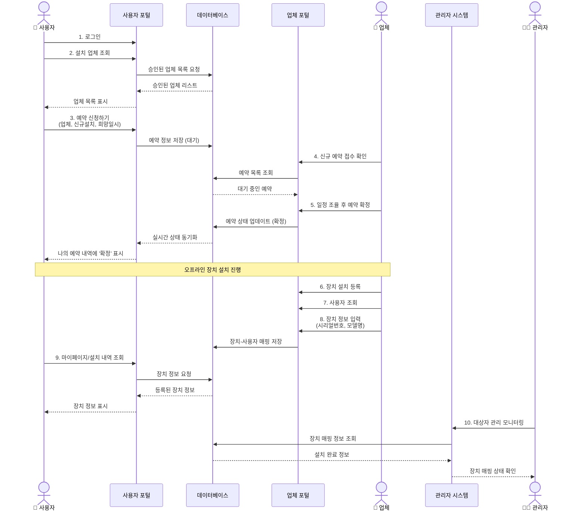
```mermaid
sequenceDiagram
    actor User as 👤 사용자
    participant UserPortal as 사용자 포털
    participant DB as 데이터베이스
    participant OpPortal as 업체 포털
    actor Operator as 🏢 업체
    participant AdminSys as 관리자 시스템
    actor Admin as 👨‍💼 관리자

    User->>UserPortal: 1. 로그인
    User->>UserPortal: 2. 설치 업체 조회
    UserPortal->>DB: 승인된 업체 목록 요청
    DB-->>UserPortal: 승인된 업체 리스트
    UserPortal-->>User: 업체 목록 표시

    User->>UserPortal: 3. 예약 신청하기<br/>(업체, 신규설치, 희망일시)
    UserPortal->>DB: 예약 정보 저장 (대기)

    Operator->>OpPortal: 4. 신규 예약 접수 확인
    OpPortal->>DB: 예약 목록 조회
    DB-->>OpPortal: 대기 중인 예약
    Operator->>OpPortal: 5. 일정 조율 후 예약 확정
    OpPortal->>DB: 예약 상태 업데이트 (확정)

    DB-->>UserPortal: 실시간 상태 동기화
    UserPortal-->>User: 나의 예약 내역에 '확정' 표시

    Note over User,Operator: 오프라인 장치 설치 진행

    Operator->>OpPortal: 6. 장치 설치 등록
    Operator->>OpPortal: 7. 사용자 조회
    Operator->>OpPortal: 8. 장치 정보 입력<br/>(시리얼번호, 모델명)
    OpPortal->>DB: 장치-사용자 매핑 저장

    User->>UserPortal: 9. 마이페이지/설치 내역 조회
    UserPortal->>DB: 장치 정보 요청
    DB-->>UserPortal: 등록된 장치 정보
    UserPortal-->>User: 장치 정보 표시

    Admin->>AdminSys: 10. 대상자 관리 모니터링
    AdminSys->>DB: 장치 매핑 정보 조회
    DB-->>AdminSys: 설치 완료 정보
    AdminSys-->>Admin: 장치 매핑 상태 확인
```

**주요 상태 변화**:

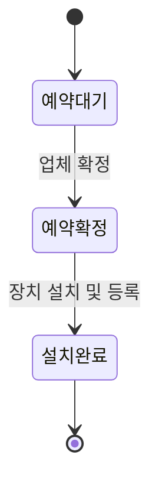
```mermaid
stateDiagram-v2
    [*] --> 예약대기
    예약대기 --> 예약확정: 업체 확정
    예약확정 --> 설치완료: 장치 설치 및 등록
    설치완료 --> [*]
```

---

### [P-03] 운행기록(로그) 제출 및 관리 프로세스

**목적**: 사용자가 주기적으로 운행기록을 제출하고, 관리자가 확인 및 분석하는 사후 관리

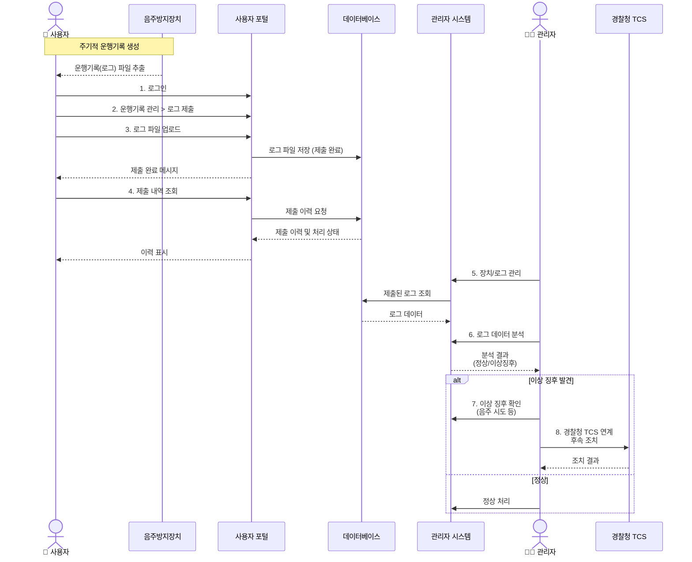
```mermaid
sequenceDiagram
    actor User as 👤 사용자
    participant Device as 음주방지장치
    participant UserPortal as 사용자 포털
    participant DB as 데이터베이스
    participant AdminSys as 관리자 시스템
    actor Admin as 👨‍💼 관리자
    participant TCS as 경찰청 TCS

    Note over User,Device: 주기적 운행기록 생성
    Device-->>User: 운행기록(로그) 파일 추출

    User->>UserPortal: 1. 로그인
    User->>UserPortal: 2. 운행기록 관리 > 로그 제출
    User->>UserPortal: 3. 로그 파일 업로드
    UserPortal->>DB: 로그 파일 저장 (제출 완료)
    UserPortal-->>User: 제출 완료 메시지

    User->>UserPortal: 4. 제출 내역 조회
    UserPortal->>DB: 제출 이력 요청
    DB-->>UserPortal: 제출 이력 및 처리 상태
    UserPortal-->>User: 이력 표시

    Admin->>AdminSys: 5. 장치/로그 관리
    AdminSys->>DB: 제출된 로그 조회
    DB-->>AdminSys: 로그 데이터

    Admin->>AdminSys: 6. 로그 데이터 분석
    AdminSys-->>Admin: 분석 결과<br/>(정상/이상징후)

    alt 이상 징후 발견
        Admin->>AdminSys: 7. 이상 징후 확인<br/>(음주 시도 등)
        Admin->>TCS: 8. 경찰청 TCS 연계<br/>후속 조치
        TCS-->>Admin: 조치 결과
    else 정상
        Admin->>AdminSys: 정상 처리
    end
```

**로그 분석 흐름**:

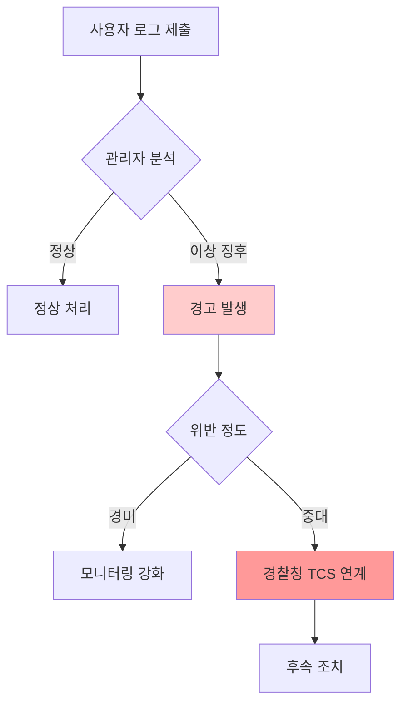
```mermaid
flowchart TD
    A[사용자 로그 제출] --> B{관리자 분석}
    B -->|정상| C[정상 처리]
    B -->|이상 징후| D[경고 발생]
    D --> E{위반 정도}
    E -->|경미| F[모니터링 강화]
    E -->|중대| G[경찰청 TCS 연계]
    G --> H[후속 조치]

    style D fill:#ffcccc
    style G fill:#ff9999
```

---

### [P-04] 장치 검·교정 및 유지보수 프로세스

**목적**: 법적 주기에 따른 정기 검·교정 또는 A/S 발생 시 예약 및 결과 등록

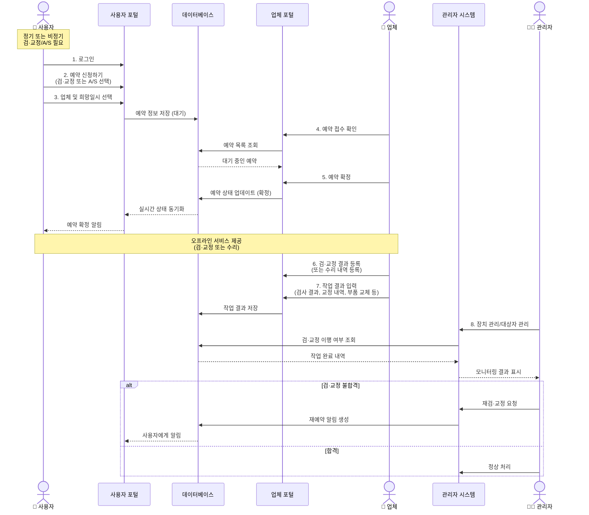
```mermaid
sequenceDiagram
    actor User as 👤 사용자
    participant UserPortal as 사용자 포털
    participant DB as 데이터베이스
    participant OpPortal as 업체 포털
    actor Operator as 🏢 업체
    participant AdminSys as 관리자 시스템
    actor Admin as 👨‍💼 관리자

    Note over User: 정기 또는 비정기<br/>검·교정/A/S 필요

    User->>UserPortal: 1. 로그인
    User->>UserPortal: 2. 예약 신청하기<br/>(검·교정 또는 A/S 선택)
    User->>UserPortal: 3. 업체 및 희망일시 선택
    UserPortal->>DB: 예약 정보 저장 (대기)

    Operator->>OpPortal: 4. 예약 접수 확인
    OpPortal->>DB: 예약 목록 조회
    DB-->>OpPortal: 대기 중인 예약
    Operator->>OpPortal: 5. 예약 확정
    OpPortal->>DB: 예약 상태 업데이트 (확정)

    DB-->>UserPortal: 실시간 상태 동기화
    UserPortal-->>User: 예약 확정 알림

    Note over User,Operator: 오프라인 서비스 제공<br/>(검·교정 또는 수리)

    Operator->>OpPortal: 6. 검·교정 결과 등록<br/>(또는 수리 내역 등록)
    Operator->>OpPortal: 7. 작업 결과 입력<br/>(검사 결과, 교정 내역, 부품 교체 등)
    OpPortal->>DB: 작업 결과 저장

    Admin->>AdminSys: 8. 장치 관리/대상자 관리
    AdminSys->>DB: 검·교정 이행 여부 조회
    DB-->>AdminSys: 작업 완료 내역
    AdminSys-->>Admin: 모니터링 결과 표시

    alt 검·교정 불합격
        Admin->>AdminSys: 재검·교정 요청
        AdminSys->>DB: 재예약 알림 생성
        DB-->>UserPortal: 사용자에게 알림
    else 합격
        Admin->>AdminSys: 정상 처리
    end
```

**검·교정 주기 관리**:

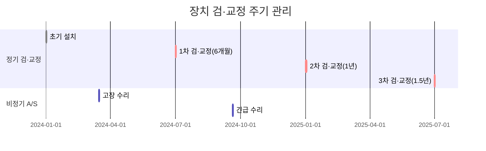
```mermaid
gantt
    title 장치 검·교정 주기 관리
    dateFormat YYYY-MM-DD
    section 정기 검·교정
    초기 설치           :done, init, 2024-01-01, 1d
    1차 검·교정(6개월)  :crit, check1, 2024-07-01, 1d
    2차 검·교정(1년)    :crit, check2, 2025-01-01, 1d
    3차 검·교정(1.5년)  :crit, check3, 2025-07-01, 1d
    section 비정기 A/S
    고장 수리           :active, as1, 2024-03-15, 1d
    긴급 수리           :as2, 2024-09-20, 1d
```

---

## 3. 통합 프로세스 플로우

### 전체 시스템 상호작용 개요

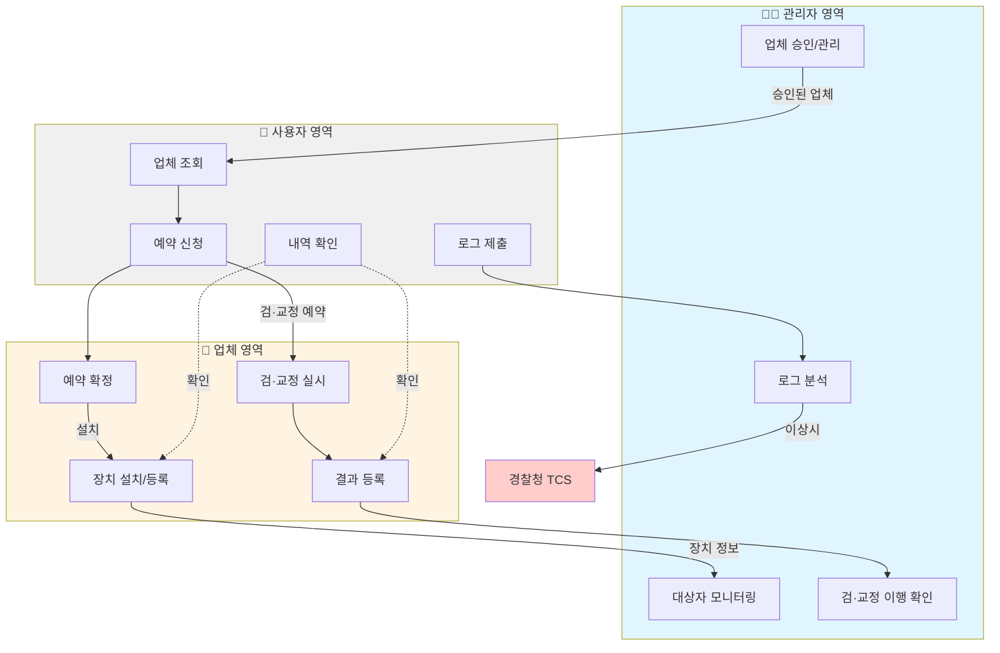
```mermaid
flowchart TB
    subgraph Admin["👨‍💼 관리자 영역"]
        A1[업체 승인/관리]
        A2[대상자 모니터링]
        A3[로그 분석]
        A4[검·교정 이행 확인]
    end

    subgraph Operator["🏢 업체 영역"]
        O1[예약 확정]
        O2[장치 설치/등록]
        O3[검·교정 실시]
        O4[결과 등록]
    end

    subgraph User["👤 사용자 영역"]
        U1[업체 조회]
        U2[예약 신청]
        U3[로그 제출]
        U4[내역 확인]
    end

    A1 -->|승인된 업체| U1
    U1 --> U2
    U2 --> O1
    O1 -->|설치| O2
    O2 -->|장치 정보| A2

    U3 --> A3
    A3 -->|이상시| TCS[경찰청 TCS]

    U2 -->|검·교정 예약| O3
    O3 --> O4
    O4 --> A4

    U4 -.->|확인| O2
    U4 -.->|확인| O4

    style Admin fill:#e1f5ff
    style Operator fill:#fff4e1
    style User fill:#f0f0f0
    style TCS fill:#ffcccc
```

---

## 4. 핵심 데이터 흐름

### 주요 데이터 엔티티 관계

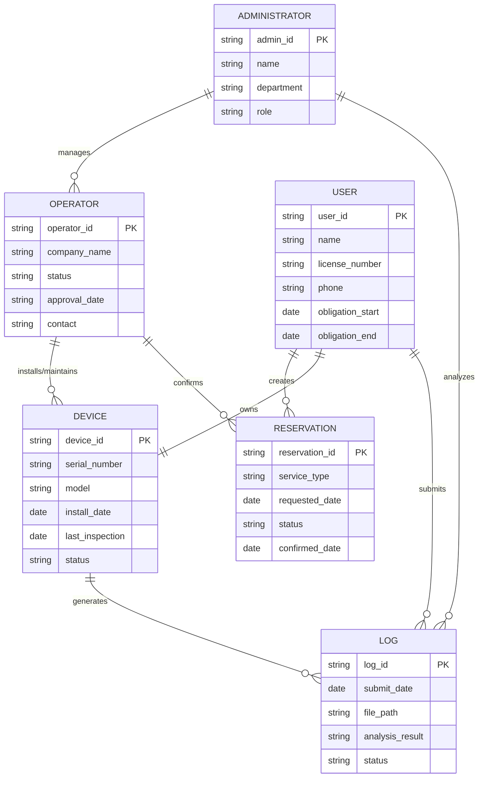
```mermaid
erDiagram
    ADMINISTRATOR ||--o{ OPERATOR : manages
    OPERATOR ||--o{ DEVICE : "installs/maintains"
    OPERATOR ||--o{ RESERVATION : confirms
    USER ||--o{ RESERVATION : creates
    USER ||--|| DEVICE : owns
    USER ||--o{ LOG : submits
    DEVICE ||--o{ LOG : generates
    ADMINISTRATOR ||--o{ LOG : analyzes

    ADMINISTRATOR {
        string admin_id PK
        string name
        string department
        string role
    }

    OPERATOR {
        string operator_id PK
        string company_name
        string status
        string approval_date
        string contact
    }

    USER {
        string user_id PK
        string name
        string license_number
        string phone
        date obligation_start
        date obligation_end
    }

    DEVICE {
        string device_id PK
        string serial_number
        string model
        date install_date
        date last_inspection
        string status
    }

    RESERVATION {
        string reservation_id PK
        string service_type
        date requested_date
        string status
        date confirmed_date
    }

    LOG {
        string log_id PK
        date submit_date
        string file_path
        string analysis_result
        string status
    }
```

---

## 5. 프로세스별 주요 화면 및 기능

### 관리자 시스템

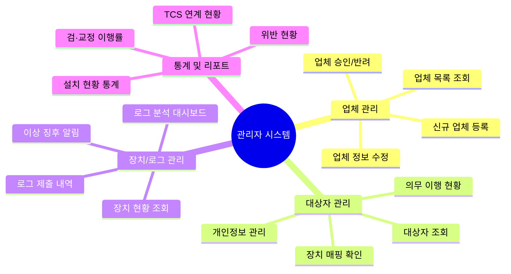
```mermaid
mindmap
  root((관리자 시스템))
    업체 관리
      신규 업체 등록
      업체 승인/반려
      업체 정보 수정
      업체 목록 조회
    대상자 관리
      대상자 조회
      장치 매핑 확인
      의무 이행 현황
      개인정보 관리
    장치/로그 관리
      장치 현황 조회
      로그 제출 내역
      로그 분석 대시보드
      이상 징후 알림
    통계 및 리포트
      설치 현황 통계
      검·교정 이행률
      위반 현황
      TCS 연계 현황
```

### 업체 포털

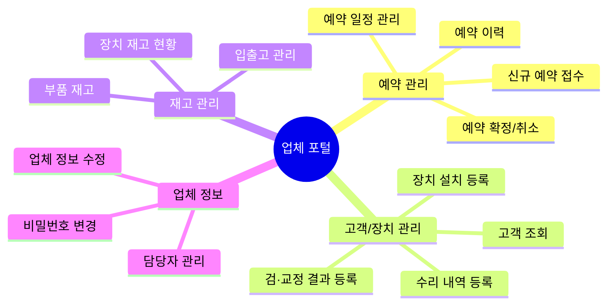
```mermaid
mindmap
  root((업체 포털))
    예약 관리
      신규 예약 접수
      예약 확정/취소
      예약 일정 관리
      예약 이력
    고객/장치 관리
      고객 조회
      장치 설치 등록
      검·교정 결과 등록
      수리 내역 등록
    재고 관리
      장치 재고 현황
      부품 재고
      입출고 관리
    업체 정보
      업체 정보 수정
      담당자 관리
      비밀번호 변경
```

### 사용자 포털

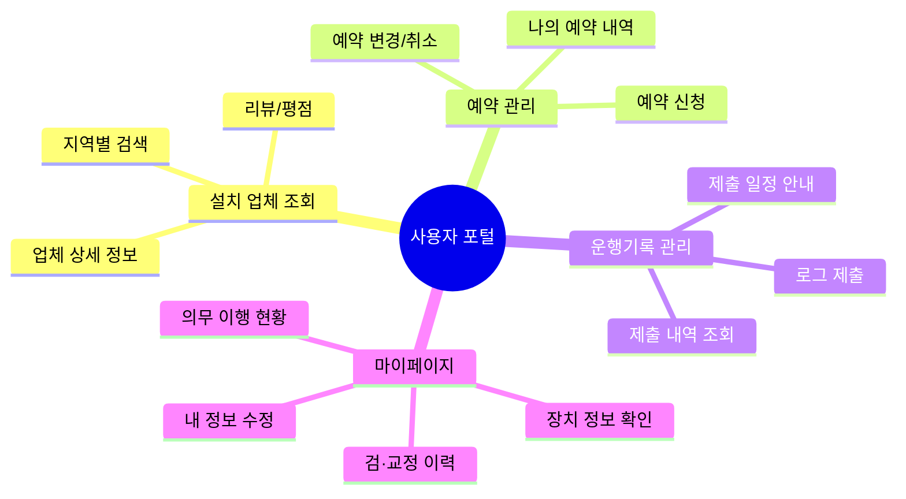
```mermaid
mindmap
  root((사용자 포털))
    설치 업체 조회
      지역별 검색
      업체 상세 정보
      리뷰/평점
    예약 관리
      예약 신청
      나의 예약 내역
      예약 변경/취소
    운행기록 관리
      로그 제출
      제출 내역 조회
      제출 일정 안내
    마이페이지
      내 정보 수정
      장치 정보 확인
      검·교정 이력
      의무 이행 현황
```

---

## 6. 예외 상황 처리

### [E-01] 예약 취소 프로세스

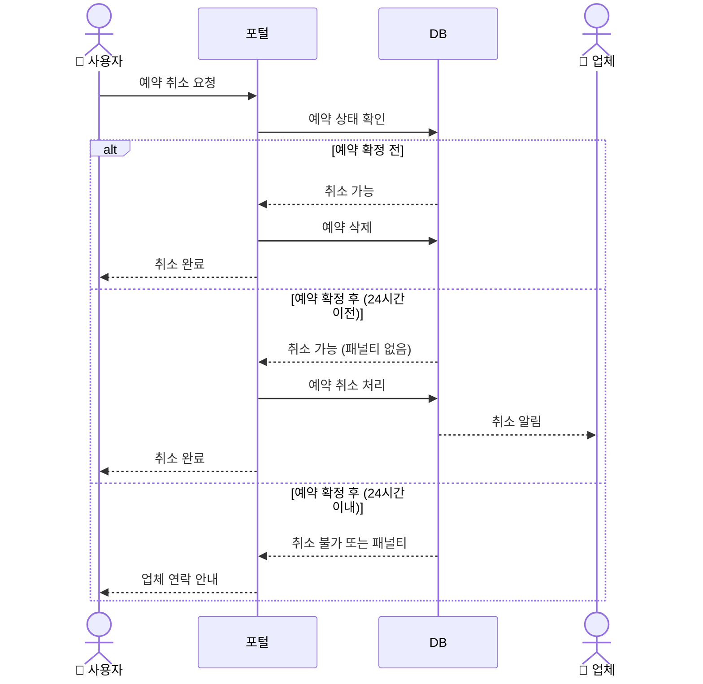
```mermaid
sequenceDiagram
    actor User as 👤 사용자
    participant Portal as 포털
    participant DB as DB
    actor Operator as 🏢 업체

    User->>Portal: 예약 취소 요청
    Portal->>DB: 예약 상태 확인

    alt 예약 확정 전
        DB-->>Portal: 취소 가능
        Portal->>DB: 예약 삭제
        Portal-->>User: 취소 완료
    else 예약 확정 후 (24시간 이전)
        DB-->>Portal: 취소 가능 (패널티 없음)
        Portal->>DB: 예약 취소 처리
        DB-->>Operator: 취소 알림
        Portal-->>User: 취소 완료
    else 예약 확정 후 (24시간 이내)
        DB-->>Portal: 취소 불가 또는 패널티
        Portal-->>User: 업체 연락 안내
    end
```

### [E-02] 장치 고장 긴급 처리

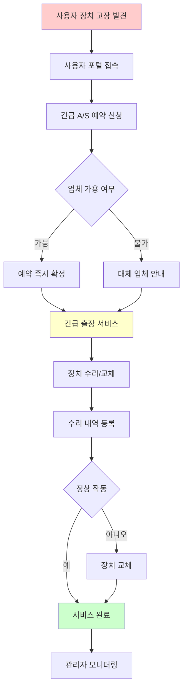
```mermaid
flowchart TD
    A[사용자 장치 고장 발견] --> B[사용자 포털 접속]
    B --> C[긴급 A/S 예약 신청]
    C --> D{업체 가용 여부}
    D -->|가능| E[예약 즉시 확정]
    D -->|불가| F[대체 업체 안내]
    E --> G[긴급 출장 서비스]
    F --> G
    G --> H[장치 수리/교체]
    H --> I[수리 내역 등록]
    I --> J{정상 작동}
    J -->|예| K[서비스 완료]
    J -->|아니오| L[장치 교체]
    L --> K
    K --> M[관리자 모니터링]

    style A fill:#ffcccc
    style G fill:#ffffcc
    style K fill:#ccffcc
```

---

## 7. 시스템 알림 및 이벤트

### 자동 알림 트리거

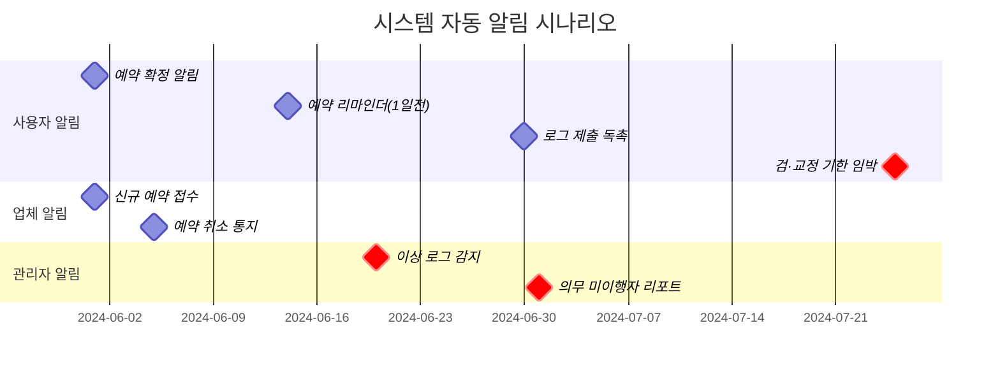
```mermaid
gantt
    title 시스템 자동 알림 시나리오
    dateFormat YYYY-MM-DD
    section 사용자 알림
    예약 확정 알림        :milestone, m1, 2024-06-01, 0d
    예약 리마인더(1일전)  :milestone, m2, 2024-06-14, 0d
    로그 제출 독촉        :milestone, m3, 2024-06-30, 0d
    검·교정 기한 임박     :crit, milestone, m4, 2024-07-25, 0d

    section 업체 알림
    신규 예약 접수        :milestone, m5, 2024-06-01, 0d
    예약 취소 통지        :milestone, m6, 2024-06-05, 0d

    section 관리자 알림
    이상 로그 감지        :crit, milestone, m7, 2024-06-20, 0d
    의무 미이행자 리포트  :crit, milestone, m8, 2024-07-01, 0d
```

---

## 8. 보안 및 권한 관리

### 역할 기반 접근 제어 (RBAC)

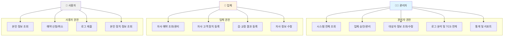
```mermaid
graph TD
    subgraph "관리자 권한"
        A1[시스템 전체 조회]
        A2[업체 승인/관리]
        A3[대상자 정보 조회/수정]
        A4[로그 분석 및 TCS 연계]
        A5[통계 및 리포트]
    end

    subgraph "업체 권한"
        O1[자사 예약 조회/관리]
        O2[자사 고객 장치 등록]
        O3[검·교정 결과 등록]
        O4[자사 정보 수정]
    end

    subgraph "사용자 권한"
        U1[본인 정보 조회]
        U2[예약 신청/취소]
        U3[로그 제출]
        U4[본인 장치 정보 조회]
    end

    Admin[👨‍💼 관리자] --> A1 & A2 & A3 & A4 & A5
    Operator[🏢 업체] --> O1 & O2 & O3 & O4
    User[👤 사용자] --> U1 & U2 & U3 & U4

    style Admin fill:#e1f5ff
    style Operator fill:#fff4e1
    style User fill:#f0f0f0
```

---

## 9. 외부 시스템 연계

### TCS(교통범죄정보시스템) 연계

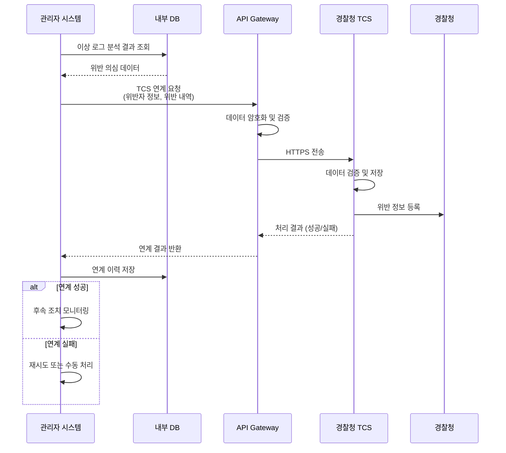
```mermaid
sequenceDiagram
    participant Admin as 관리자 시스템
    participant DB as 내부 DB
    participant Gateway as API Gateway
    participant TCS as 경찰청 TCS
    participant Police as 경찰청

    Admin->>DB: 이상 로그 분석 결과 조회
    DB-->>Admin: 위반 의심 데이터

    Admin->>Gateway: TCS 연계 요청<br/>(위반자 정보, 위반 내역)
    Gateway->>Gateway: 데이터 암호화 및 검증
    Gateway->>TCS: HTTPS 전송

    TCS->>TCS: 데이터 검증 및 저장
    TCS->>Police: 위반 정보 등록
    TCS-->>Gateway: 처리 결과 (성공/실패)
    Gateway-->>Admin: 연계 결과 반환

    Admin->>DB: 연계 이력 저장

    alt 연계 성공
        Admin->>Admin: 후속 조치 모니터링
    else 연계 실패
        Admin->>Admin: 재시도 또는 수동 처리
    end
```

---

## 10. 프로세스 성공 지표 (KPI)

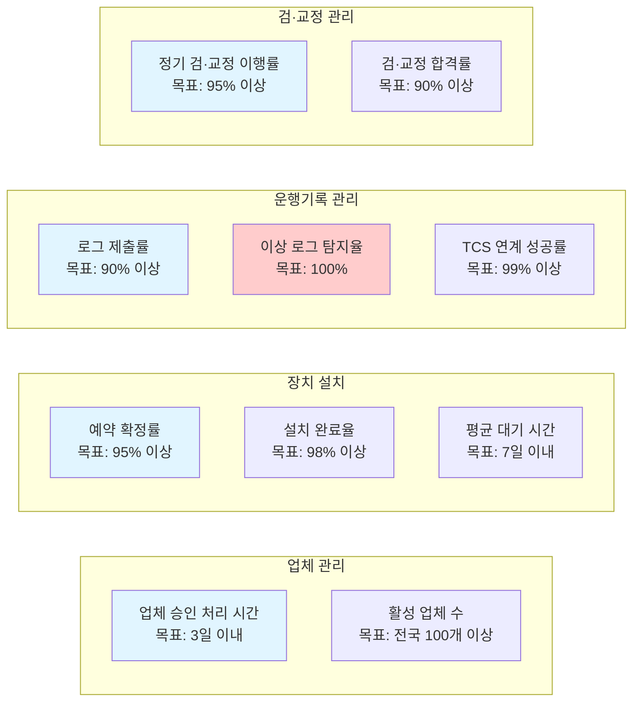
```mermaid
graph LR
    subgraph "업체 관리"
        K1[업체 승인 처리 시간<br/>목표: 3일 이내]
        K2[활성 업체 수<br/>목표: 전국 100개 이상]
    end

    subgraph "장치 설치"
        K3[예약 확정률<br/>목표: 95% 이상]
        K4[설치 완료율<br/>목표: 98% 이상]
        K5[평균 대기 시간<br/>목표: 7일 이내]
    end

    subgraph "운행기록 관리"
        K6[로그 제출률<br/>목표: 90% 이상]
        K7[이상 로그 탐지율<br/>목표: 100%]
        K8[TCS 연계 성공률<br/>목표: 99% 이상]
    end

    subgraph "검·교정 관리"
        K9[정기 검·교정 이행률<br/>목표: 95% 이상]
        K10[검·교정 합격률<br/>목표: 90% 이상]
    end

    style K1 fill:#e1f5ff
    style K3 fill:#e1f5ff
    style K6 fill:#e1f5ff
    style K7 fill:#ffcccc
    style K9 fill:#e1f5ff
```

---

## 문서 정보

- **작성일**: 2025년 10월 20일
- **버전**: 1.0
- **작성자**: DDP 프로젝트 팀
- **승인자**: 도로교통공단

---

## 참고사항

1. 모든 프로세스는 개인정보보호법 및 정보보안 정책을 준수합니다.
2. 시스템 간 데이터 연계는 암호화된 통신(HTTPS, TLS 1.2 이상)을 사용합니다.
3. 사용자 인증은 2단계 인증(2FA)을 권장합니다.
4. 모든 중요 작업은 감사 로그(Audit Log)에 기록됩니다.
5. 장애 발생 시 비즈니스 연속성 계획(BCP)에 따라 대응합니다.
