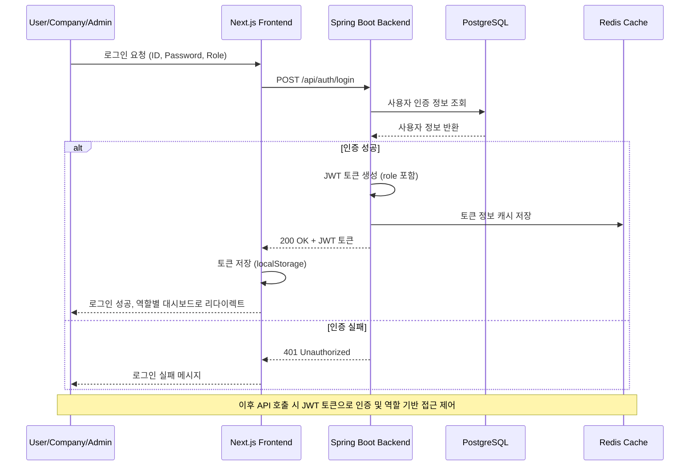
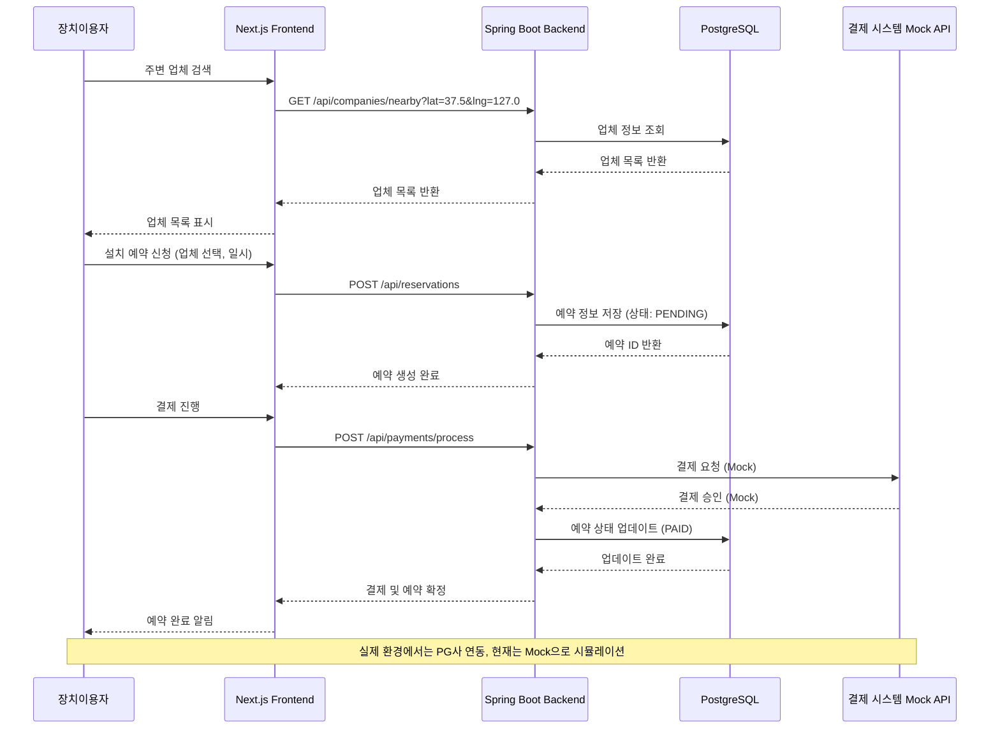
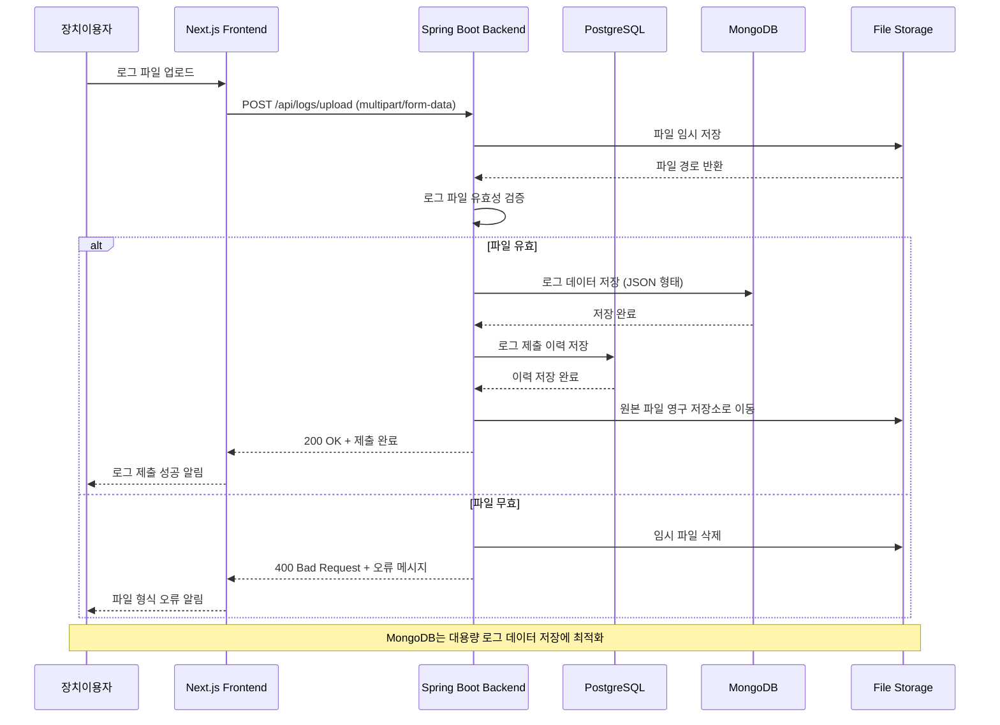
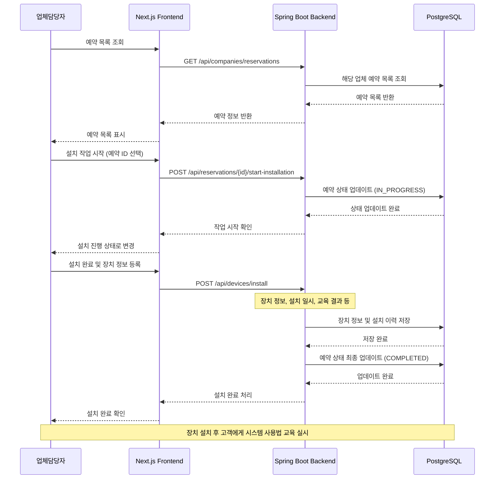
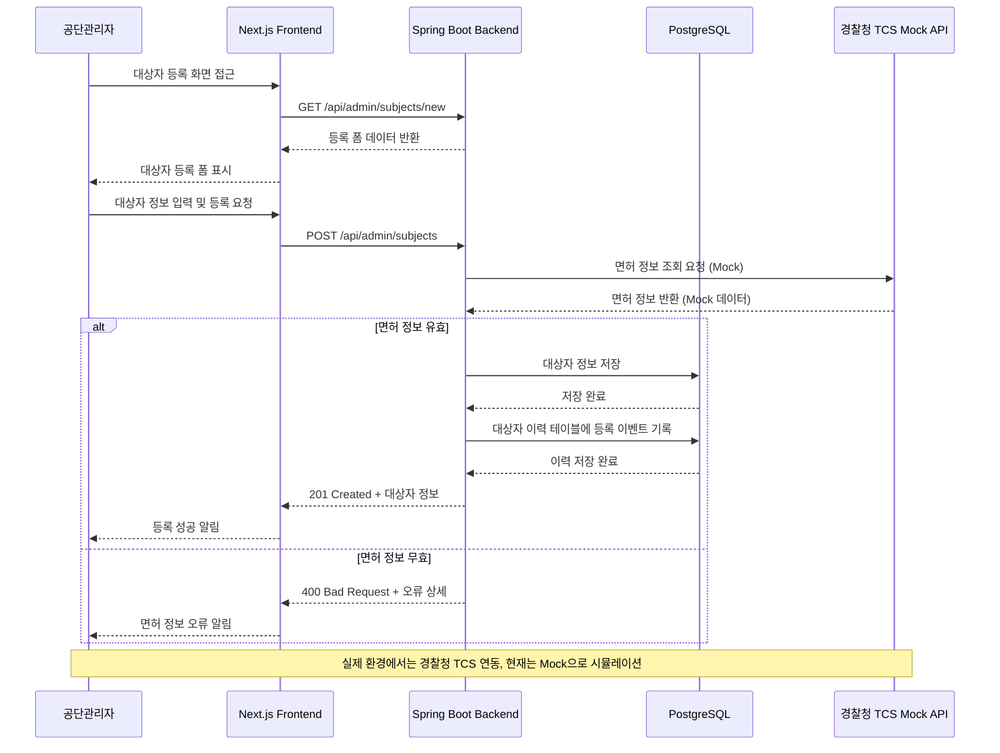
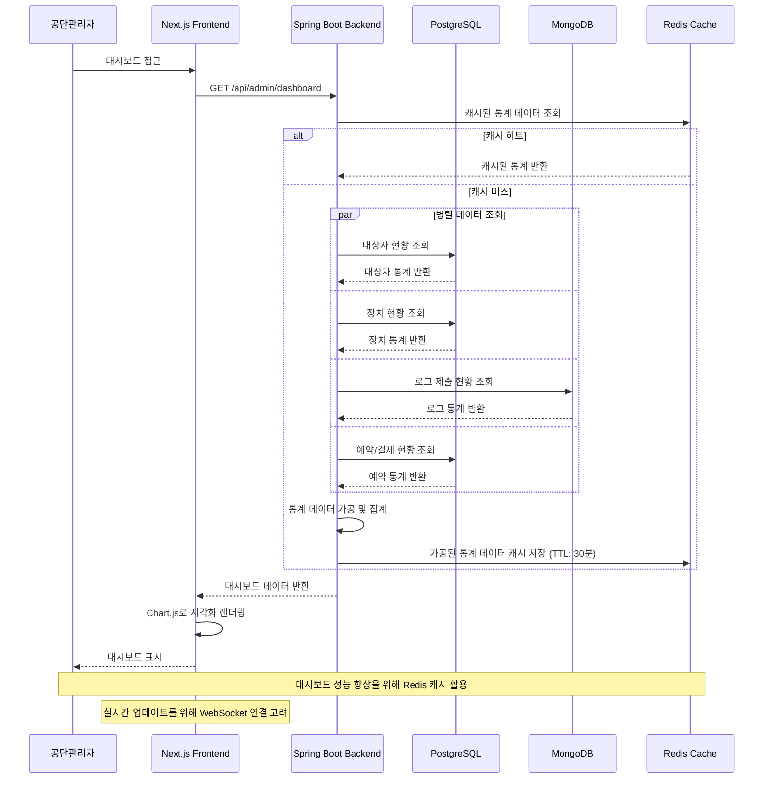

# 음주운전 방지장치 통합운영관리시스템 Sequence Diagrams

본 문서는 음주운전 방지장치 통합운영관리시스템의 주요 기능들에 대한 Sequence Diagram을 제공합니다.

## 시스템 구성 요소

- **Frontend**: Next.js (사용자/업체/관리자 포털)
- **Backend**: Spring Boot API Server
- **Database**: PostgreSQL (트랜잭션 데이터), MongoDB (로그 데이터)
- **External Systems**: 경찰청 TCS Mock API, 결제 시스템 Mock API

---

## 1. 사용자 인증 및 역할별 접근 제어

---

## 2. 장치 설치 예약 및 결제 프로세스

---

## 3. 운행기록(로그) 제출

---

## 4. 업체의 장치 설치 처리

---

## 5. 관리자의 대상자 등록 (경찰청 연동)

---

## 6. 관리자 대시보드 현황 조회

---

## 참고사항

1. **인증/인가**: 모든 API 호출에는 JWT 토큰이 필요하며, Spring Security를 통한 RBAC 구현
2. **에러 처리**: 각 단계에서 발생할 수 있는 예외 상황에 대한 적절한 HTTP 상태 코드 및 에러 메시지 반환
3. **로깅**: 모든 중요한 비즈니스 로직 실행 시 로그 기록 (보안 감사 목적)
4. **성능 최적화**: Redis 캐시 활용, DB 쿼리 최적화, CDN을 통한 정적 자원 제공
5. **보안**: HTTPS 통신, 민감 데이터 암호화 저장, SQL Injection 방지 등