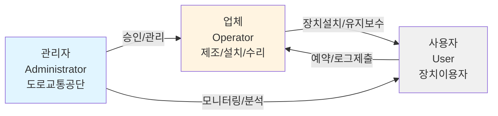
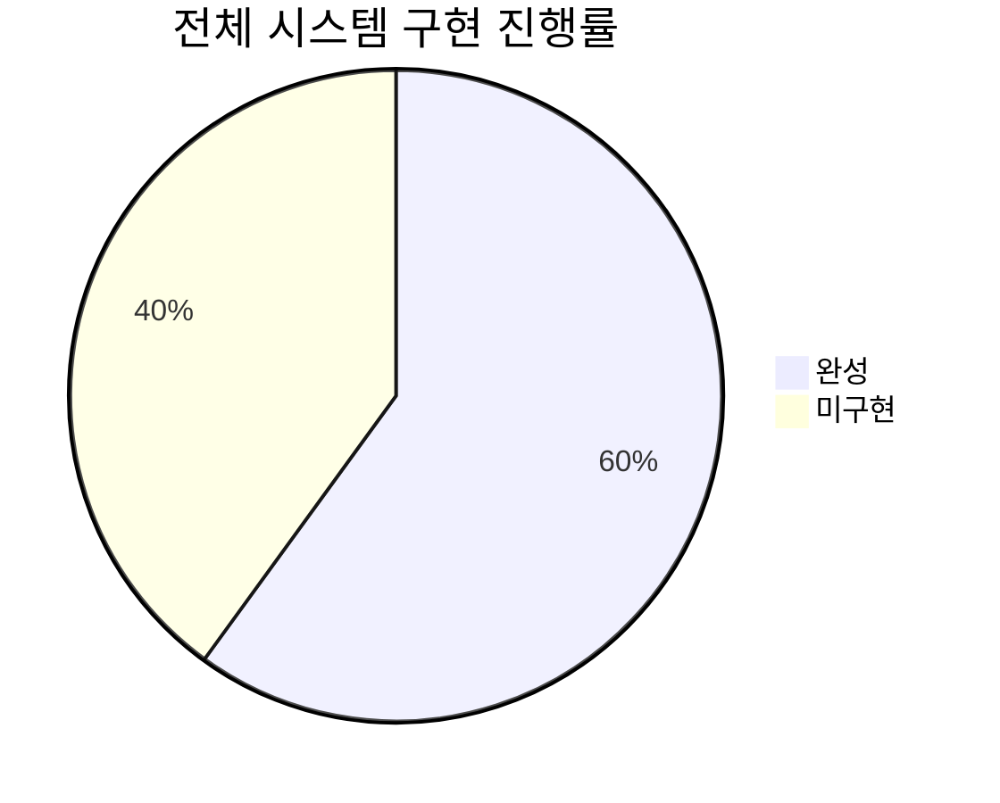
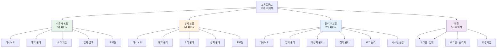
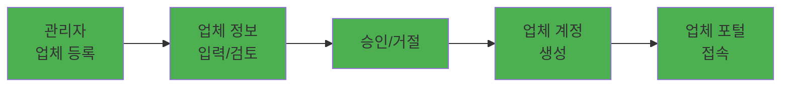
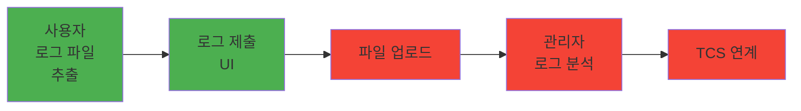
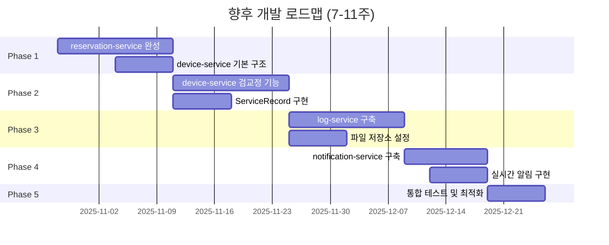
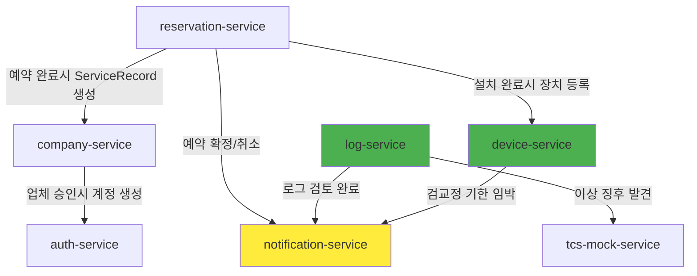
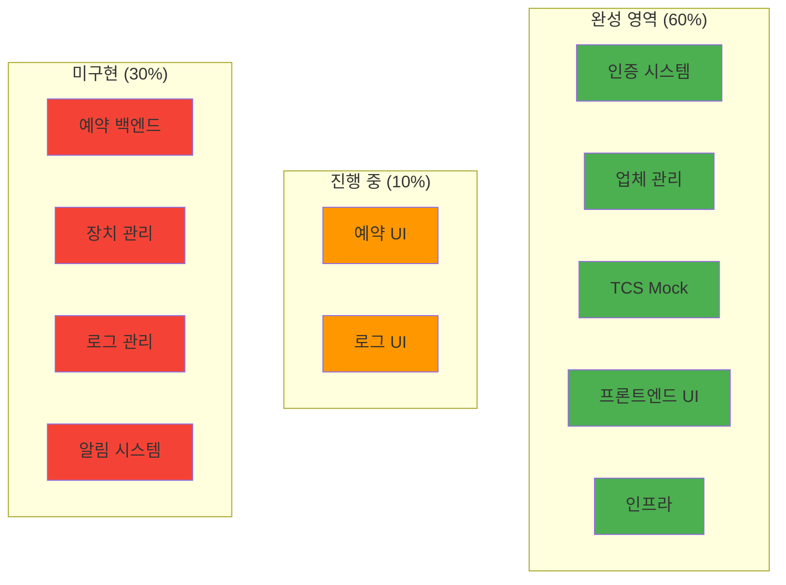

# 음주운전 방지장치 통합운영관리시스템 - 프로젝트 현황 보고서

> **작성일**: 2025년 10월 28일
> **버전**: 1.0
> **프로젝트 기간**: 진행 중 (예상 완료: 7-11주 추가 소요)

---

## 📋 목차

1. [프로젝트 개요](#1-프로젝트-개요)
2. [현재 구현 상태](#2-현재-구현-상태)
3. [4대 핵심 프로세스별 진행도](#3-4대-핵심-프로세스별-진행도)
4. [향후 개발 로드맵](#4-향후-개발-로드맵)
5. [미구현 기능 상세](#5-미구현-기능-상세)
6. [결론 및 제안](#6-결론-및-제안)

---

## 1. 프로젝트 개요

### 1.1 시스템 소개

음주운전 방지장치의 설치, 운영, 관리를 통합적으로 관리하는 웹 기반 시스템입니다.

### 1.2 주요 행위자 (Actors)



### 1.3 기술 스택

#### 프론트엔드
- **프레임워크**: Next.js 15.5.3 (App Router, Turbopack)
- **언어**: TypeScript 5
- **스타일링**: TailwindCSS 3.4.17 + shadcn/ui
- **상태관리**: Zustand 5.0.8
- **폼 처리**: React Hook Form + Zod
- **차트**: Recharts 3.2.0

#### 백엔드
- **프레임워크**: Spring Boot 3.x
- **언어**: Java 17+
- **아키텍처**: 마이크로서비스 (MSA)
- **서비스 디스커버리**: Netflix Eureka
- **API Gateway**: Spring Cloud Gateway
- **데이터베이스**: PostgreSQL (트랜잭션), MongoDB (로그), Redis (캐시)

#### 인프라
- **설정 관리**: Spring Cloud Config Server
- **컨테이너**: Docker (계획)
- **배포**: CI/CD (계획)

---

## 2. 현재 구현 상태

### 2.1 전체 진행률



### 2.2 백엔드 서비스 현황

| 서비스명 | 상태 | 완성도 | 주요 기능 | 비고 |
|---------|------|--------|----------|------|
| **auth-service** | ✅ 완성 | 100% | 인증, 사용자 관리, 계정 생성 | 8개 컨트롤러 구현 완료 |
| **company-service** | ✅ 완성 | 95% | 업체 등록/승인/관리 | ServiceRecord 엔티티 존재, API 미구현 |
| **tcs-mock-service** | ✅ 완성 | 100% | 경찰청 TCS Mock API | 면허 확인, 위반 보고 |
| **reservation-service** | ⚠️ 부분 | 5% | 예약 관리 | 프로젝트 구조만 존재 |
| **device-service** | ❌ 없음 | 0% | 장치 관리, 검·교정 | 구현 필요 |
| **log-service** | ❌ 없음 | 0% | 운행기록 로그 관리 | 구현 필요 |
| **notification-service** | ❌ 없음 | 0% | 알림 시스템 | 구현 필요 |
| **인프라 서비스** | ✅ 완성 | 100% | Eureka, Config, Gateway | 완료 |

#### 백엔드 세부 현황

**✅ auth-service (완성)**
- 구현된 컨트롤러:
  - `AuthController`: 로그인, 로그아웃, 토큰 검증/갱신
  - `UserRegistrationController`: 사용자 회원가입
  - `AdminAccountController`: 관리자 계정 관리
  - `CompanyAccountController`: 업체 계정 관리
  - `UserProfileController`: 사용자 프로필 관리
- JWT 토큰 기반 인증 (httpOnly 쿠키)
- 역할 기반 접근 제어 (RBAC)

**✅ company-service (95% 완성)**
- 구현된 컨트롤러:
  - `CompanyController`: 업체 CRUD, 승인/거절
  - `PublicOperatorController`: 공개 업체 검색
- 구현된 엔티티:
  - `Company`: 업체 정보
  - `ServiceRecord`: 서비스 이력 (Controller 미구현)
  - `Customer`: 고객 정보
  - `ManagedDevice`: 관리 장치
- 부족한 부분: ServiceRecord Controller/Service 구현 필요

**✅ tcs-mock-service (완성)**
- 면허 확인 API
- 위반 보고 API
- 경찰청 연계 Mock 완성

**⚠️ reservation-service (5%)**
- 프로젝트 구조만 존재
- Application 클래스만 있음
- Entity, Controller, Service 모두 미구현

**❌ device-service (없음)**
- 마이크로서비스 자체가 없음
- 장치 등록, 관리, 검·교정 기능 필요

**❌ log-service (없음)**
- 마이크로서비스 자체가 없음
- 운행기록 로그 업로드, 분석, TCS 연계 필요

**❌ notification-service (없음)**
- 마이크로서비스 자체가 없음
- 이메일, SMS, 웹 푸시 알림 필요

### 2.3 프론트엔드 기능 현황



**✅ 프론트엔드 완성도: 80%**

- **features 폴더**: auth, admin, company, log, operator, reservation, user (전체 구현)
- **API 통신 레이어**: `lib/axios.ts` 완성, features별 api.ts 구현
- **상태 관리**: Zustand 설정 완료
- **인증 미들웨어**: `middleware.ts` 구현 (라우트 보호)
- **UI 컴포넌트**: shadcn/ui 기반 컴포넌트 라이브러리 구축

**부족한 부분**:
- 백엔드 API가 없는 기능들은 Mock 데이터 사용 중
- device-service, log-service API 연동 대기
- 실시간 알림 기능 미구현

---

## 3. 4대 핵심 프로세스별 진행도

### 3.1 [P-01] 업체 등록 및 관리 프로세스

**진행도**: ✅ **95% 완성**



**구현 완료**:
- ✅ 관리자의 업체 등록 UI
- ✅ 업체 승인/거절 로직
- ✅ 업체 계정 자동 생성 (auth-service 연동)
- ✅ 업체 목록 조회 (검색, 필터링)
- ✅ 업체 상세 정보 조회
- ✅ 공개 업체 검색 API (사용자용)

**부족한 부분**:
- ⚠️ 업체 정보 수정 API 테스트 필요
- ⚠️ 업체 문서 업로드 기능 (파일 저장소 필요)

---

### 3.2 [P-02] 장치 설치 예약 및 등록 프로세스

**진행도**: ⚠️ **30% 완성**


**구현 완료**:
- ✅ 사용자: 업체 검색 UI
- ✅ 사용자: 예약 신청 UI
- ✅ 업체: 예약 관리 UI

**미구현**:
- ❌ reservation-service 백엔드 (Entity, Controller, Service)
- ❌ device-service 백엔드 (장치 등록 API)
- ❌ 예약 확정/취소 정책
- ❌ 예약 완료 시 장치 등록 연동
- ❌ ServiceRecord 자동 생성

**필요한 작업**:
1. **reservation-service 완성** (1-2주)
   - Reservation 엔티티 생성
   - API 엔드포인트 구현 (9개)
   - 예약 상태 관리 (PENDING → CONFIRMED → COMPLETED)
2. **device-service 구축** (2-3주)
   - 새 마이크로서비스 생성
   - Device, InspectionRecord 엔티티
   - API 엔드포인트 구현 (9개)

---

### 3.3 [P-03] 운행기록(로그) 제출 및 관리 프로세스

**진행도**: ⚠️ **20% 완성**



**구현 완료**:
- ✅ 사용자: 로그 제출 UI
- ✅ 관리자: 로그 관리 UI
- ✅ TCS Mock API (경찰청 연계)

**미구현**:
- ❌ log-service 백엔드 전체
- ❌ 파일 업로드 처리 (S3/MinIO)
- ❌ 로그 파일 검증 로직
- ❌ 로그 데이터 분석 (이상 징후 탐지)
- ❌ TCS 연계 실제 구현

**필요한 작업**:
1. **log-service 구축** (2-3주)
   - 새 마이크로서비스 생성
   - DrivingLog 엔티티
   - API 엔드포인트 구현 (7개)
   - 파일 저장소 설정 (S3/MinIO)
2. **파일 업로드 기능** (1주)
   - 멀티파트 파일 업로드
   - 파일 검증 (크기, 형식)
3. **로그 분석 로직** (1주)
   - 기본 규칙 기반 분석
   - 이상 징후 탐지

---

### 3.4 [P-04] 장치 검·교정 및 유지보수 프로세스

**진행도**: ⚠️ **25% 완성**


**구현 완료**:
- ✅ 예약 UI (신규설치와 동일 UI)
- ✅ company-service의 ServiceRecord 엔티티

**미구현**:
- ❌ device-service의 InspectionRecord
- ❌ 검·교정 결과 등록 API
- ❌ 검·교정 주기 계산 로직
- ❌ 검·교정 기한 임박 알림
- ❌ ServiceRecord Controller/Service

**필요한 작업**:
1. **device-service 검·교정 기능** (1-2주)
   - InspectionRecord 엔티티
   - 검·교정 이력 API
   - 주기 계산 로직 (6개월, 1년)
2. **company-service ServiceRecord API** (1주)
   - ServiceRecordController 구현
   - 서비스 이력 조회/등록

---

## 4. 향후 개발 로드맵

### 4.1 개발 단계 개요



### 4.2 Phase별 상세 계획

#### **Phase 1: 예약 시스템 완성 (1-2주)**

**목표**: reservation-service 완성, device-service 기본 구조

**백엔드 작업**:
1. reservation-service 구현
   - Reservation 엔티티 생성
   - API 엔드포인트 9개 구현
   - 예약 상태 관리 로직
   - 예약 취소 정책 구현

2. device-service 프로젝트 생성
   - Spring Boot 프로젝트 구조
   - Eureka Client 설정
   - PostgreSQL 연결

**프론트엔드 작업**:
- features/reservation/api.ts 백엔드 연동
- 예약 취소 정책 UI 추가
- 에러 처리 강화

**예상 기간**: 1-2주

---

#### **Phase 2: 장치 관리 완성 (2-3주)**

**목표**: device-service 검·교정 기능, ServiceRecord 구현

**백엔드 작업**:
1. device-service 완성
   - Device, InspectionRecord 엔티티
   - API 엔드포인트 9개 구현
   - 검·교정 주기 계산
   - 검·교정 기한 임박 알림 (7일 전)

2. company-service ServiceRecord API
   - ServiceRecordController 생성
   - ServiceRecordService 구현
   - 예약 완료 시 자동 생성 연동

**프론트엔드 작업**:
- features/device 폴더 생성
- admin/devices/page.tsx 완성
- 사용자 페이지 장치 정보 연동

**예상 기간**: 2-3주

---

#### **Phase 3: 로그 관리 시스템 (2-3주)**

**목표**: log-service 구축, 파일 저장소 설정

**백엔드 작업**:
1. log-service 구축
   - DrivingLog 엔티티
   - API 엔드포인트 7개 구현
   - 파일 업로드 처리 (멀티파트)
   - 로그 파일 검증

2. 파일 저장소
   - S3 또는 MinIO 설정
   - 파일 업로드/다운로드 API
   - 파일 암호화

3. 로그 분석
   - 기본 규칙 기반 분석
   - 이상 징후 탐지
   - TCS 연계 (tcs-mock-service 호출)

**프론트엔드 작업**:
- features/log/api.ts 파일 업로드 구현
- admin/log/page.tsx 완성
- 파일 업로드 진행률 표시

**예상 기간**: 2-3주

---

#### **Phase 4: 알림 시스템 (1-2주)**

**목표**: notification-service 구축

**백엔드 작업**:
1. notification-service 구축
   - Notification 엔티티
   - API 엔드포인트 4개 구현
   - 이벤트 기반 알림 발송

2. 알림 채널 구현
   - 이메일 발송 (SMTP)
   - SMS 발송 (Twilio/Aligo)
   - 웹 푸시 알림 (선택)

**프론트엔드 작업**:
- 알림 아이콘 및 팝오버
- 알림 목록 페이지
- 실시간 알림 (웹소켓 또는 폴링)

**예상 기간**: 1-2주

---

#### **Phase 5: 최종 통합 및 최적화 (1주)**

**목표**: 통계/리포트, 성능 최적화, 최종 테스트

**작업**:
1. 통계 및 리포트
   - 각 서비스별 통계 API
   - KPI 계산 로직
   - 대시보드 차트 연동

2. 시스템 개선
   - API Gateway 라우팅 업데이트
   - 전역 예외 처리
   - 데이터베이스 인덱스 추가
   - Redis 캐싱

3. 최종 테스트
   - 통합 테스트
   - 성능 테스트
   - 버그 수정

**예상 기간**: 1주

---

### 4.3 서비스 간 통합 포인트



**통신 방식**: Feign Client를 사용한 동기 HTTP 통신 (초기)
- 필요시 메시징 시스템(Kafka/RabbitMQ)으로 전환 가능

---

## 5. 미구현 기능 상세

### 5.1 reservation-service

**필요한 엔티티**:
```java
Reservation {
    Long reservationId (PK)
    Long userId
    Long companyId
    ServiceType serviceType // INSTALLATION, INSPECTION, MAINTENANCE, REPAIR
    LocalDateTime requestedDate
    LocalDateTime confirmedDate
    LocalDateTime completedDate
    ReservationStatus status // PENDING, CONFIRMED, COMPLETED, CANCELLED, REJECTED
    String vehicleInfo
    String notes
    String cancelledReason
    LocalDateTime cancelledAt
}
```

**필요한 API 엔드포인트**:
- `POST /api/v1/reservations` - 예약 생성
- `GET /api/v1/reservations/user/{userId}` - 사용자의 예약 목록
- `GET /api/v1/reservations/company/{companyId}` - 업체의 예약 목록
- `GET /api/v1/reservations/{id}` - 예약 상세 조회
- `PATCH /api/v1/reservations/{id}/confirm` - 예약 확정 (업체)
- `PATCH /api/v1/reservations/{id}/reject` - 예약 거절 (업체)
- `PATCH /api/v1/reservations/{id}/complete` - 예약 완료 (업체)
- `DELETE /api/v1/reservations/{id}` - 예약 취소 (사용자)
- `GET /api/v1/admin/reservations` - 전체 예약 목록 (관리자)

---

### 5.2 device-service

**필요한 엔티티**:
```java
Device {
    Long deviceId (PK)
    String serialNumber (고유)
    String modelName
    Long manufacturerId
    Long userId
    Long companyId
    DeviceStatus status // ACTIVE, INACTIVE, UNDER_MAINTENANCE, DEACTIVATED
    LocalDate installDate
    LocalDate lastInspectionDate
    LocalDate nextInspectionDate
    LocalDate warrantyEndDate
}

InspectionRecord {
    Long id (PK)
    Long deviceId (FK)
    LocalDate inspectionDate
    Long inspectorId
    InspectionResult result // PASS, FAIL, CONDITIONAL_PASS
    String notes
    LocalDate nextInspectionDate
}
```

**필요한 API 엔드포인트**:
- `POST /api/v1/devices` - 장치 등록
- `GET /api/v1/devices/{id}` - 장치 상세 조회
- `GET /api/v1/devices/user/{userId}` - 사용자의 장치 조회
- `GET /api/v1/devices/company/{companyId}` - 업체가 관리하는 장치 목록
- `PATCH /api/v1/devices/{id}/status` - 장치 상태 변경
- `POST /api/v1/devices/{id}/inspections` - 검·교정 이력 등록
- `GET /api/v1/devices/{id}/inspections` - 검·교정 이력 조회
- `GET /api/v1/admin/devices` - 전체 장치 목록 (관리자)
- `GET /api/v1/admin/devices/inspection-due` - 검·교정 기한 임박 장치 목록

---

### 5.3 log-service

**필요한 엔티티**:
```java
DrivingLog {
    Long logId (PK)
    Long userId
    Long deviceId
    LocalDateTime submitDate
    LocalDate periodStart
    LocalDate periodEnd
    String filePath
    Long fileSize
    String fileName
    LogStatus status // SUBMITTED, UNDER_REVIEW, APPROVED, REJECTED, FLAGGED
    String analysisResult
    AnomalyType anomalyType // NORMAL, TAMPERING_ATTEMPT, BYPASS_ATTEMPT, etc.
    Long reviewedBy
    LocalDateTime reviewedAt
    String notes
}
```

**필요한 API 엔드포인트**:
- `POST /api/v1/logs/submit` - 로그 파일 제출 (파일 업로드)
- `GET /api/v1/logs/user/{userId}` - 사용자의 로그 제출 이력
- `GET /api/v1/logs/{id}` - 로그 상세 조회
- `GET /api/v1/admin/logs` - 전체 로그 목록 (관리자)
- `GET /api/v1/admin/logs/flagged` - 이상 징후 로그 목록
- `PATCH /api/v1/admin/logs/{id}/review` - 로그 검토 (승인/반려)
- `POST /api/v1/admin/logs/{id}/report-tcs` - 경찰청 TCS 연계

---

### 5.4 notification-service

**필요한 엔티티**:
```java
Notification {
    Long notificationId (PK)
    Long userId
    NotificationType type // RESERVATION_CONFIRMED, LOG_APPROVED, INSPECTION_DUE, etc.
    String title
    String message
    Boolean isRead
    LocalDateTime createdAt
    LocalDateTime readAt
}
```

**필요한 API 엔드포인트**:
- `GET /api/v1/notifications/user/{userId}` - 사용자 알림 목록
- `PATCH /api/v1/notifications/{id}/read` - 알림 읽음 처리
- `POST /api/v1/notifications/send` - 알림 발송 (내부 API)
- `POST /api/v1/admin/notifications/broadcast` - 전체 공지 (관리자)

---

## 6. 결론 및 제안

### 6.1 현재 상태 요약



**전체 진행률**: 약 **60%**

**완성 영역**:
- ✅ 인증 및 사용자 관리 시스템
- ✅ 업체 관리 시스템 (95%)
- ✅ 외부 연계 Mock API
- ✅ 프론트엔드 UI/UX (80%)
- ✅ 마이크로서비스 인프라

**미완성 영역**:
- ❌ 예약 관리 백엔드
- ❌ 장치 관리 시스템
- ❌ 로그 관리 시스템
- ❌ 알림 시스템

---

### 6.2 우선순위 매트릭스

| 기능 | 긴급도 | 중요도 | 우선순위 | 예상 기간 |
|-----|--------|--------|----------|----------|
| **reservation-service** | 높음 | 높음 | 🔴 1순위 | 1-2주 |
| **device-service** | 높음 | 높음 | 🔴 1순위 | 2-3주 |
| **log-service** | 중간 | 높음 | 🟡 2순위 | 2-3주 |
| **notification-service** | 낮음 | 중간 | 🟢 3순위 | 1-2주 |
| **파일 저장소** | 중간 | 높음 | 🟡 2순위 | 1주 |
| **통계/리포트** | 낮음 | 중간 | 🟢 3순위 | 1주 |

---

### 6.3 리스크 및 대응 방안

#### 리스크 1: 서비스 간 통신 복잡도
- **문제**: 여러 마이크로서비스 간 동기 호출로 인한 장애 전파
- **대응**:
  - 초기에는 Feign Client 사용
  - 추후 메시징 시스템(Kafka) 도입 검토
  - Circuit Breaker (Resilience4j) 적용

#### 리스크 2: 파일 저장소 용량
- **문제**: 로그 파일이 누적되면 저장 공간 부족
- **대응**:
  - S3/MinIO 사용 (확장 가능)
  - 오래된 파일 자동 아카이빙
  - 파일 압축 정책

#### 리스크 3: 개발 일정 지연
- **문제**: 예상보다 복잡한 요구사항 발생 가능
- **대응**:
  - MVP(최소 기능 제품) 우선 개발
  - 주 단위 스프린트 및 리뷰
  - 기능 우선순위 재조정 유연성 확보

---

### 6.4 최종 제안

#### 단기 목표 (1개월)
1. **reservation-service 완성** (최우선)
   - 예약 생성, 확정, 취소 기능
   - 업체-사용자 간 예약 흐름 완성
2. **device-service 기본 구축**
   - 장치 등록 및 조회 기능
   - 예약 완료 시 장치 등록 연동

#### 중기 목표 (2-3개월)
1. **log-service 완성**
   - 파일 업로드 및 저장
   - 기본 로그 분석
   - TCS 연계
2. **notification-service 구축**
   - 이메일/SMS 알림
   - 예약, 로그, 검·교정 관련 알림

#### 장기 목표 (3개월 이후)
1. **고급 기능 추가**
   - 실시간 대시보드
   - AI 기반 로그 분석
   - 모바일 앱 (선택)
2. **성능 최적화**
   - 데이터베이스 튜닝
   - 캐싱 전략
   - 로드 밸런싱

---

## 📊 핵심 지표 (KPI)

| 지표 | 현재 | 목표 |
|-----|------|------|
| 전체 진행률 | 60% | 100% |
| 백엔드 서비스 완성도 | 4/8 | 8/8 |
| 프론트엔드 완성도 | 80% | 100% |
| 4대 핵심 프로세스 구현 | 1.5/4 | 4/4 |
| 예상 추가 개발 기간 | - | 7-11주 |

---

## 📚 참고 문서

- [프로세스 정의서](PRD/process-definition-diagrams.md)
- [시퀀스 다이어그램](PRD/sequence-diagrams.md)
- [데이터 흐름 다이어그램](PRD/data-flow-diagram.md)
- [개발 가이드라인](CLAUDE.md)

---

**문서 종료**
