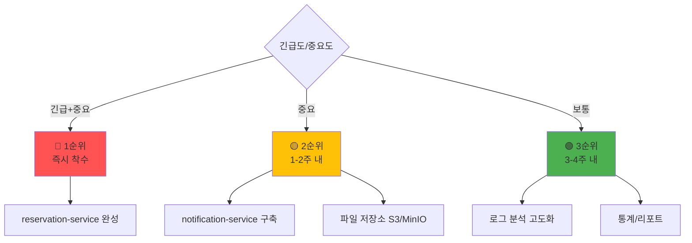
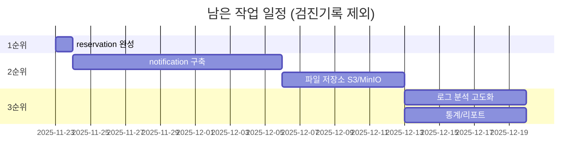

# 📋 DDP 프로젝트 남은 작업 목록

> **분석 기준일**: 2025년 11월 22일
> **전체 남은 작업**: 20%
> **예상 완료일**: 2025년 12월 20일 (약 4주)

---

## ⚠️ 중요: 개발 범위 조정

### ❌ 제외되는 항목 (검진기록 관련)

다음 항목은 개발 범위에서 **제외**됩니다:

1. **InspectionRecord 엔티티** (device-service)
   - 검교정 이력 상세 테이블
   - 검교정 결과 (PASS/FAIL)
   - 검사자 정보

2. **RepairRecord 엔티티** (device-service)
   - 수리 이력 상세 테이블
   - 교체 부품 정보
   - 수리 비용

3. **검교정 관련 API**
   - `POST /api/v1/devices/{id}/inspections`
   - `GET /api/v1/devices/{id}/inspections`
   - `POST /api/v1/devices/{id}/repairs`
   - `GET /api/v1/devices/{id}/repairs`

4. **검교정 주기 계산 로직**
   - 6개월/1년 주기 자동 계산
   - nextInspectionDate 자동 업데이트

5. **검교정 기한 임박 알림**
   - `GET /api/v1/admin/devices/inspection-due`
   - 7일 전 알림 발송

**대체 방안**:
- ServiceRecord 엔티티로 간단히 관리
- ServiceType.INSPECTION, ServiceType.REPAIR로 구분
- 상세 이력은 description 필드에 JSON/텍스트로 저장

---

## ✅ 실제 개발할 작업 목록

### 우선순위 매트릭스



---

## 🔴 1순위: 즉시 착수 (1-3일)

### Task 1: reservation-service 완성 (10%)

**현재 상태**: 90% 완성
**목표**: 100% 완성
**예상 소요**: 4-6시간

#### 1.1 예약 취소 정책 구현

**요구사항**:
- 예약일 24시간 전 취소: 수수료 없음
- 예약일 24시간 이내 취소: 취소 수수료 부과 (예약금의 50%)

**구현 파일**:
- `backend/reservation-service/src/main/java/com/ddp/reservation/service/ReservationService.java`

**추가 필드**:
```java
// Reservation 엔티티에 추가
private BigDecimal cancellationFee; // 취소 수수료
private String cancellationPolicy; // 취소 정책 (24H_BEFORE, 24H_WITHIN)
```

**서비스 메서드**:
```java
public void cancelReservation(Long reservationId, Long userId, String reason) {
    Reservation reservation = findReservationWithValidation(reservationId, userId);

    // 취소 가능한 상태인지 확인
    if (reservation.getStatus() == ReservationStatus.COMPLETED) {
        throw new IllegalStateException("완료된 예약은 취소할 수 없습니다");
    }

    // 24시간 전/후 계산
    LocalDateTime now = LocalDateTime.now();
    LocalDateTime reservationTime = reservation.getRequestedDate();
    long hoursUntilReservation = ChronoUnit.HOURS.between(now, reservationTime);

    BigDecimal fee = BigDecimal.ZERO;
    String policy = "24H_BEFORE";

    if (hoursUntilReservation < 24) {
        // 24시간 이내 취소 - 취소 수수료 50%
        fee = reservation.getEstimatedCost().multiply(new BigDecimal("0.5"));
        policy = "24H_WITHIN";
    }

    reservation.setStatus(ReservationStatus.CANCELLED);
    reservation.setCancelledReason(reason);
    reservation.setCancelledAt(now);
    reservation.setCancellationFee(fee);
    reservation.setCancellationPolicy(policy);

    reservationRepository.save(reservation);
}
```

**예상 소요**: 2시간

---

#### 1.2 동일 시간대 중복 예약 방지

**요구사항**:
- 동일 업체, 동일 시간대(±2시간)에 중복 예약 불가

**구현 파일**:
- `backend/reservation-service/src/main/java/com/ddp/reservation/repository/ReservationRepository.java`
- `backend/reservation-service/src/main/java/com/ddp/reservation/service/ReservationService.java`

**Repository 쿼리 메서드**:
```java
@Repository
public interface ReservationRepository extends JpaRepository<Reservation, Long> {

    @Query("SELECT r FROM Reservation r WHERE r.companyId = :companyId " +
           "AND r.requestedDate BETWEEN :startTime AND :endTime " +
           "AND r.status IN ('PENDING', 'CONFIRMED')")
    List<Reservation> findConflictingReservations(
        @Param("companyId") Long companyId,
        @Param("startTime") LocalDateTime startTime,
        @Param("endTime") LocalDateTime endTime
    );
}
```

**서비스 검증 로직**:
```java
private void validateReservationTime(Long companyId, LocalDateTime requestedDate) {
    LocalDateTime startWindow = requestedDate.minusHours(2);
    LocalDateTime endWindow = requestedDate.plusHours(2);

    List<Reservation> conflicts = reservationRepository.findConflictingReservations(
        companyId, startWindow, endWindow
    );

    if (!conflicts.isEmpty()) {
        throw new IllegalStateException(
            "해당 시간대에 이미 예약이 존재합니다. 다른 시간을 선택해주세요."
        );
    }
}

// createReservation() 메서드 내에서 호출
public ReservationResponse createReservation(CreateReservationRequest request) {
    // 중복 예약 검증 추가
    validateReservationTime(request.getCompanyId(), request.getRequestedDate());

    // 기존 예약 생성 로직...
}
```

**예상 소요**: 2시간

---

#### 1.3 프론트엔드 연동

**수정 파일**:
- `frontend/src/features/reservation/api.ts`
- `frontend/src/app/user/reservations/page.tsx`

**취소 정책 UI 추가**:
```typescript
// features/reservation/api.ts
export const reservationApi = {
  // 예약 취소
  cancel: async (reservationId: number, reason: string) => {
    const startTime = performance.now();
    console.log('API 호출 시작: 예약 취소');

    try {
      const response = await apiClient.delete(
        `/reservations/${reservationId}`,
        { data: { reason } }
      );

      const endTime = performance.now();
      console.log(`API 호출 완료: 예약 취소 (${(endTime - startTime).toFixed(2)}ms)`);

      return response.data;
    } catch (error) {
      const endTime = performance.now();
      console.log(`API 호출 실패: 예약 취소 (${(endTime - startTime).toFixed(2)}ms)`);
      throw error;
    }
  },
};
```

**취소 정책 안내 컴포넌트**:
```typescript
// 예약 취소 다이얼로그에 추가
const CancellationPolicyWarning = ({ reservationDate }) => {
  const hoursUntil = Math.floor(
    (new Date(reservationDate) - new Date()) / (1000 * 60 * 60)
  );

  const isWithin24Hours = hoursUntil < 24;

  return (
    <Alert variant={isWithin24Hours ? "destructive" : "default"}>
      <AlertTitle>취소 정책 안내</AlertTitle>
      <AlertDescription>
        {isWithin24Hours ? (
          <>
            예약일까지 24시간 이내입니다.
            <br />
            취소 수수료(예약금의 50%)가 부과됩니다.
          </>
        ) : (
          <>
            예약일까지 24시간 이상 남았습니다.
            <br />
            취소 수수료 없이 취소 가능합니다.
          </>
        )}
      </AlertDescription>
    </Alert>
  );
};
```

**예상 소요**: 2시간

---

**Task 1 총 예상 소요**: 6시간

---

## 🟡 2순위: 1-2주 내 (중요)

### Task 2: notification-service 구축 (100%)

**현재 상태**: 0%
**목표**: 100% 완성
**예상 소요**: 1.5주 (10-12일)

#### 2.1 새 마이크로서비스 생성 (1일)

**작업 내용**:
1. Spring Boot 프로젝트 구조 생성
2. Eureka Client 설정
3. PostgreSQL 연결 설정
4. 기본 디렉토리 구조

**프로젝트 구조**:
```
backend/notification-service/
├── src/main/java/com/ddp/notification/
│   ├── NotificationServiceApplication.java
│   ├── controller/
│   │   ├── NotificationController.java
│   │   └── AdminNotificationController.java
│   ├── service/
│   │   ├── NotificationService.java
│   │   ├── EmailService.java (SMTP)
│   │   └── SmsService.java (Twilio/Aligo)
│   ├── repository/
│   │   └── NotificationRepository.java
│   ├── entity/
│   │   ├── Notification.java
│   │   └── NotificationType.java (enum)
│   ├── dto/
│   │   ├── request/SendNotificationRequest.java
│   │   └── response/NotificationResponse.java
│   └── client/
│       ├── AuthServiceClient.java
│       └── ReservationServiceClient.java
└── resources/
    └── application.yml
```

---

#### 2.2 Notification 엔티티 생성 (0.5일)

```java
@Entity
@Table(name = "notifications")
@Getter
@Setter
@Builder
@NoArgsConstructor(access = AccessLevel.PROTECTED)
@AllArgsConstructor(access = AccessLevel.PRIVATE)
public class Notification {

    @Id
    @GeneratedValue(strategy = GenerationType.IDENTITY)
    private Long notificationId;

    @Column(nullable = false)
    private Long userId; // 수신자 ID

    @Enumerated(EnumType.STRING)
    @Column(nullable = false)
    private NotificationType type;

    @Column(nullable = false, length = 200)
    private String title; // 알림 제목

    @Column(nullable = false, length = 1000)
    private String message; // 알림 내용

    @Column(nullable = false)
    private Boolean isRead = false; // 읽음 여부

    @Column(nullable = false)
    private LocalDateTime createdAt;

    private LocalDateTime readAt; // 읽은 시각

    // 알림 채널 (웹, 이메일, SMS 중 어떤 방식으로 발송했는지)
    @Column(length = 50)
    private String channel; // WEB, EMAIL, SMS

    // 추가 데이터 (JSON 형식)
    @Column(columnDefinition = "TEXT")
    private String metadata;

    @PrePersist
    protected void onCreate() {
        createdAt = LocalDateTime.now();
    }
}
```

**NotificationType enum**:
```java
public enum NotificationType {
    // 예약 관련
    RESERVATION_CONFIRMED("예약 확정"),
    RESERVATION_REJECTED("예약 거절"),
    RESERVATION_CANCELLED("예약 취소"),
    RESERVATION_REMINDER("예약 알림"),

    // 로그 관련
    LOG_SUBMITTED("로그 제출 완료"),
    LOG_APPROVED("로그 승인"),
    LOG_REJECTED("로그 반려"),
    LOG_FLAGGED("로그 이상 징후"),
    LOG_REMINDER("로그 제출 기한"),

    // 시스템 관련
    SYSTEM_ANNOUNCEMENT("시스템 공지"),
    ACCOUNT_ACTIVATED("계정 활성화"),
    ACCOUNT_SUSPENDED("계정 정지");

    private final String description;

    NotificationType(String description) {
        this.description = description;
    }

    public String getDescription() {
        return description;
    }
}
```

---

#### 2.3 NotificationController API 구현 (1일)

**API 엔드포인트**:

```java
@RestController
@RequestMapping("/api/v1/notifications")
@RequiredArgsConstructor
public class NotificationController {

    private final NotificationService notificationService;

    // 사용자 알림 목록 조회
    @GetMapping("/user/{userId}")
    public ResponseEntity<List<NotificationResponse>> getUserNotifications(
        @PathVariable Long userId,
        @RequestParam(defaultValue = "false") Boolean unreadOnly
    ) {
        List<NotificationResponse> notifications =
            notificationService.getUserNotifications(userId, unreadOnly);
        return ResponseEntity.ok(notifications);
    }

    // 알림 읽음 처리
    @PatchMapping("/{id}/read")
    public ResponseEntity<Void> markAsRead(@PathVariable Long id) {
        notificationService.markAsRead(id);
        return ResponseEntity.ok().build();
    }

    // 모든 알림 읽음 처리
    @PatchMapping("/user/{userId}/read-all")
    public ResponseEntity<Void> markAllAsRead(@PathVariable Long userId) {
        notificationService.markAllAsRead(userId);
        return ResponseEntity.ok().build();
    }

    // 알림 삭제
    @DeleteMapping("/{id}")
    public ResponseEntity<Void> deleteNotification(@PathVariable Long id) {
        notificationService.deleteNotification(id);
        return ResponseEntity.ok().build();
    }

    // 읽지 않은 알림 개수
    @GetMapping("/user/{userId}/unread-count")
    public ResponseEntity<Long> getUnreadCount(@PathVariable Long userId) {
        long count = notificationService.getUnreadCount(userId);
        return ResponseEntity.ok(count);
    }
}
```

**내부 API** (다른 서비스에서 호출):
```java
@RestController
@RequestMapping("/api/v1/internal/notifications")
@RequiredArgsConstructor
public class InternalNotificationController {

    private final NotificationService notificationService;

    // 알림 발송 (내부 API)
    @PostMapping("/send")
    public ResponseEntity<NotificationResponse> sendNotification(
        @RequestBody SendNotificationRequest request
    ) {
        NotificationResponse response = notificationService.send(request);
        return ResponseEntity.ok(response);
    }

    // 대량 알림 발송
    @PostMapping("/send-bulk")
    public ResponseEntity<Void> sendBulkNotifications(
        @RequestBody List<SendNotificationRequest> requests
    ) {
        notificationService.sendBulk(requests);
        return ResponseEntity.ok().build();
    }
}
```

**관리자 API**:
```java
@RestController
@RequestMapping("/api/v1/admin/notifications")
@RequiredArgsConstructor
public class AdminNotificationController {

    private final NotificationService notificationService;

    // 전체 공지 발송
    @PostMapping("/broadcast")
    public ResponseEntity<Void> broadcastNotification(
        @RequestBody BroadcastNotificationRequest request
    ) {
        notificationService.broadcast(request);
        return ResponseEntity.ok().build();
    }

    // 전체 알림 조회 (관리자용)
    @GetMapping
    public ResponseEntity<Page<NotificationResponse>> getAllNotifications(
        @RequestParam(defaultValue = "0") int page,
        @RequestParam(defaultValue = "20") int size
    ) {
        Page<NotificationResponse> notifications =
            notificationService.getAllNotifications(PageRequest.of(page, size));
        return ResponseEntity.ok(notifications);
    }
}
```

---

#### 2.4 NotificationService 구현 (2일)

**알림 발송 로직**:
```java
@Service
@Transactional
@RequiredArgsConstructor
public class NotificationService {

    private final NotificationRepository notificationRepository;
    private final EmailService emailService;
    private final SmsService smsService;

    // 알림 발송
    public NotificationResponse send(SendNotificationRequest request) {
        // 1. DB에 알림 저장 (웹 알림)
        Notification notification = Notification.builder()
            .userId(request.getUserId())
            .type(request.getType())
            .title(request.getTitle())
            .message(request.getMessage())
            .channel("WEB")
            .metadata(request.getMetadata())
            .build();

        notification = notificationRepository.save(notification);

        // 2. 이메일 발송 (선택적)
        if (request.isSendEmail()) {
            emailService.sendNotificationEmail(
                request.getUserEmail(),
                request.getTitle(),
                request.getMessage()
            );
        }

        // 3. SMS 발송 (선택적, 긴급한 경우만)
        if (request.isSendSms() && isUrgent(request.getType())) {
            smsService.sendNotificationSms(
                request.getUserPhone(),
                request.getMessage()
            );
        }

        return NotificationResponse.from(notification);
    }

    // 긴급 알림 판단
    private boolean isUrgent(NotificationType type) {
        return type == NotificationType.LOG_FLAGGED ||
               type == NotificationType.ACCOUNT_SUSPENDED ||
               type == NotificationType.RESERVATION_REJECTED;
    }

    // 대량 알림 발송
    public void sendBulk(List<SendNotificationRequest> requests) {
        requests.forEach(this::send);
    }

    // 전체 공지
    public void broadcast(BroadcastNotificationRequest request) {
        // 모든 활성 사용자 조회 (AuthService에서)
        // 각 사용자에게 알림 발송
        // 구현 생략...
    }
}
```

---

#### 2.5 이메일 서비스 구현 (1일)

**EmailService** (SMTP):
```java
@Service
@RequiredArgsConstructor
public class EmailService {

    private final JavaMailSender mailSender;

    @Value("${spring.mail.username}")
    private String fromEmail;

    public void sendNotificationEmail(String toEmail, String subject, String content) {
        try {
            MimeMessage message = mailSender.createMimeMessage();
            MimeMessageHelper helper = new MimeMessageHelper(message, true, "UTF-8");

            helper.setFrom(fromEmail);
            helper.setTo(toEmail);
            helper.setSubject(subject);
            helper.setText(buildHtmlContent(content), true);

            mailSender.send(message);

            log.info("이메일 발송 성공: {}", toEmail);
        } catch (Exception e) {
            log.error("이메일 발송 실패: {}", toEmail, e);
            throw new RuntimeException("이메일 발송 중 오류가 발생했습니다", e);
        }
    }

    private String buildHtmlContent(String content) {
        return """
            <!DOCTYPE html>
            <html>
            <body>
                <div style="font-family: Arial, sans-serif; padding: 20px;">
                    <h2>DDP 음주운전 방지장치 관리시스템</h2>
                    <div style="margin-top: 20px;">
                        %s
                    </div>
                    <hr style="margin-top: 30px;"/>
                    <p style="font-size: 12px; color: #666;">
                        본 메일은 발신 전용입니다.
                    </p>
                </div>
            </body>
            </html>
            """.formatted(content);
    }
}
```

**application.yml** (SMTP 설정):
```yaml
spring:
  mail:
    host: smtp.gmail.com
    port: 587
    username: ${MAIL_USERNAME}
    password: ${MAIL_PASSWORD}
    properties:
      mail:
        smtp:
          auth: true
          starttls:
            enable: true
```

---

#### 2.6 SMS 서비스 구현 (1일)

**SmsService** (Twilio 또는 Aligo):
```java
@Service
@RequiredArgsConstructor
public class SmsService {

    @Value("${sms.api.key}")
    private String apiKey;

    @Value("${sms.api.url}")
    private String apiUrl;

    private final RestTemplate restTemplate;

    public void sendNotificationSms(String phoneNumber, String message) {
        try {
            // SMS API 호출 (Aligo 예시)
            String url = apiUrl + "/send";

            MultiValueMap<String, String> params = new LinkedMultiValueMap<>();
            params.add("key", apiKey);
            params.add("receiver", phoneNumber);
            params.add("msg", message);
            params.add("sender", "02-1234-5678"); // 발신 번호

            HttpHeaders headers = new HttpHeaders();
            headers.setContentType(MediaType.APPLICATION_FORM_URLENCODED);

            HttpEntity<MultiValueMap<String, String>> request =
                new HttpEntity<>(params, headers);

            ResponseEntity<String> response =
                restTemplate.postForEntity(url, request, String.class);

            log.info("SMS 발송 성공: {}", phoneNumber);
        } catch (Exception e) {
            log.error("SMS 발송 실패: {}", phoneNumber, e);
            throw new RuntimeException("SMS 발송 중 오류가 발생했습니다", e);
        }
    }
}
```

---

#### 2.7 다른 서비스와 연동 (2-3일)

**reservation-service → notification-service**:
```java
// reservation-service의 ReservationService.java에 추가

@Autowired
private NotificationServiceClient notificationServiceClient;

public void confirmReservation(Long reservationId, Long companyId) {
    // 예약 확정 로직...

    // 알림 발송
    notificationServiceClient.sendNotification(
        SendNotificationRequest.builder()
            .userId(reservation.getUserId())
            .type(NotificationType.RESERVATION_CONFIRMED)
            .title("예약이 확정되었습니다")
            .message(String.format(
                "%s 업체에서 예약을 확정했습니다. 예약일: %s",
                companyName,
                reservation.getRequestedDate()
            ))
            .sendEmail(true)
            .build()
    );
}
```

**device-service → notification-service** (로그 검토 완료):
```java
// device-service의 DrivingLogService.java에 추가

public void approveLog(String logId, Long reviewerId) {
    // 로그 승인 로직...

    // 알림 발송
    notificationServiceClient.sendNotification(
        SendNotificationRequest.builder()
            .userId(log.getUserId())
            .type(NotificationType.LOG_APPROVED)
            .title("운행기록 로그가 승인되었습니다")
            .message("제출하신 운행기록 로그가 정상적으로 승인되었습니다.")
            .sendEmail(false)
            .build()
    );
}
```

---

#### 2.8 프론트엔드 연동 (2일)

**알림 API**:
```typescript
// features/notification/api.ts
export const notificationApi = {
  // 알림 목록 조회
  getList: async (unreadOnly: boolean = false) => {
    const response = await apiClient.get('/notifications/user/me', {
      params: { unreadOnly },
    });
    return response.data;
  },

  // 읽음 처리
  markAsRead: async (id: number) => {
    await apiClient.patch(`/notifications/${id}/read`);
  },

  // 모두 읽음
  markAllAsRead: async () => {
    await apiClient.patch('/notifications/user/me/read-all');
  },

  // 읽지 않은 개수
  getUnreadCount: async () => {
    const response = await apiClient.get('/notifications/user/me/unread-count');
    return response.data;
  },
};
```

**알림 아이콘 컴포넌트**:
```typescript
// components/common/notification-bell.tsx
export function NotificationBell() {
  const [unreadCount, setUnreadCount] = useState(0);

  useEffect(() => {
    // 5초마다 읽지 않은 알림 개수 조회
    const interval = setInterval(async () => {
      const count = await notificationApi.getUnreadCount();
      setUnreadCount(count);
    }, 5000);

    return () => clearInterval(interval);
  }, []);

  return (
    <Popover>
      <PopoverTrigger>
        <Button variant="ghost" size="icon" className="relative">
          <Bell className="h-5 w-5" />
          {unreadCount > 0 && (
            <span className="absolute top-0 right-0 h-4 w-4 rounded-full bg-red-500 text-xs text-white flex items-center justify-center">
              {unreadCount > 9 ? '9+' : unreadCount}
            </span>
          )}
        </Button>
      </PopoverTrigger>
      <PopoverContent>
        <NotificationList />
      </PopoverContent>
    </Popover>
  );
}
```

---

**Task 2 총 예상 소요**: 10-12일 (1.5주)

---

### Task 3: 파일 저장소 S3/MinIO (40%)

**현재 상태**: 로컬 파일 시스템만 지원
**목표**: S3/MinIO 전환
**예상 소요**: 1주

#### 3.1 S3 또는 MinIO 설정 (1일)

**MinIO 선택 권장** (로컬 개발 + 프로덕션 모두 지원):

**Docker Compose로 MinIO 실행**:
```yaml
# docker-compose.yml
version: '3.8'
services:
  minio:
    image: minio/minio:latest
    ports:
      - "9000:9000"
      - "9001:9001"
    environment:
      MINIO_ROOT_USER: admin
      MINIO_ROOT_PASSWORD: admin1234
    command: server /data --console-address ":9001"
    volumes:
      - minio_data:/data

volumes:
  minio_data:
```

**application.yml** (device-service):
```yaml
minio:
  url: http://localhost:9000
  access-key: admin
  secret-key: admin1234
  bucket-name: ddp-logs
```

---

#### 3.2 FileStorageService 리팩토링 (2일)

**기존 로컬 파일 저장 → MinIO 전환**:

```java
@Service
@RequiredArgsConstructor
public class FileStorageService {

    @Value("${minio.url}")
    private String minioUrl;

    @Value("${minio.access-key}")
    private String accessKey;

    @Value("${minio.secret-key}")
    private String secretKey;

    @Value("${minio.bucket-name}")
    private String bucketName;

    private MinioClient minioClient;

    @PostConstruct
    public void init() {
        minioClient = MinioClient.builder()
            .endpoint(minioUrl)
            .credentials(accessKey, secretKey)
            .build();

        // 버킷 생성 (없으면)
        try {
            boolean found = minioClient.bucketExists(
                BucketExistsArgs.builder().bucket(bucketName).build()
            );
            if (!found) {
                minioClient.makeBucket(
                    MakeBucketArgs.builder().bucket(bucketName).build()
                );
            }
        } catch (Exception e) {
            throw new RuntimeException("MinIO 초기화 실패", e);
        }
    }

    // 파일 업로드
    public String uploadFile(MultipartFile file, String directory) {
        try {
            String fileName = UUID.randomUUID() + "_" + file.getOriginalFilename();
            String objectName = directory + "/" + fileName;

            minioClient.putObject(
                PutObjectArgs.builder()
                    .bucket(bucketName)
                    .object(objectName)
                    .stream(file.getInputStream(), file.getSize(), -1)
                    .contentType(file.getContentType())
                    .build()
            );

            return objectName;
        } catch (Exception e) {
            throw new RuntimeException("파일 업로드 실패", e);
        }
    }

    // 파일 다운로드
    public byte[] downloadFile(String objectName) {
        try (InputStream stream = minioClient.getObject(
            GetObjectArgs.builder()
                .bucket(bucketName)
                .object(objectName)
                .build()
        )) {
            return stream.readAllBytes();
        } catch (Exception e) {
            throw new RuntimeException("파일 다운로드 실패", e);
        }
    }

    // 파일 삭제
    public void deleteFile(String objectName) {
        try {
            minioClient.removeObject(
                RemoveObjectArgs.builder()
                    .bucket(bucketName)
                    .object(objectName)
                    .build()
            );
        } catch (Exception e) {
            throw new RuntimeException("파일 삭제 실패", e);
        }
    }

    // 파일 URL 생성 (임시 접근 URL)
    public String getPresignedUrl(String objectName, int expirySeconds) {
        try {
            return minioClient.getPresignedObjectUrl(
                GetPresignedObjectUrlArgs.builder()
                    .method(Method.GET)
                    .bucket(bucketName)
                    .object(objectName)
                    .expiry(expirySeconds)
                    .build()
            );
        } catch (Exception e) {
            throw new RuntimeException("URL 생성 실패", e);
        }
    }
}
```

**pom.xml** (의존성 추가):
```xml
<dependency>
    <groupId>io.minio</groupId>
    <artifactId>minio</artifactId>
    <version>8.5.7</version>
</dependency>
```

---

#### 3.3 파일 암호화 (선택, 1일)

**AES-256 암호화**:
```java
@Service
public class EncryptionService {

    @Value("${encryption.secret-key}")
    private String secretKey;

    public byte[] encrypt(byte[] data) throws Exception {
        SecretKeySpec key = new SecretKeySpec(
            secretKey.getBytes(StandardCharsets.UTF_8), "AES"
        );
        Cipher cipher = Cipher.getInstance("AES/CBC/PKCS5Padding");
        cipher.init(Cipher.ENCRYPT_MODE, key);
        return cipher.doFinal(data);
    }

    public byte[] decrypt(byte[] encryptedData) throws Exception {
        SecretKeySpec key = new SecretKeySpec(
            secretKey.getBytes(StandardCharsets.UTF_8), "AES"
        );
        Cipher cipher = Cipher.getInstance("AES/CBC/PKCS5Padding");
        cipher.init(Cipher.DECRYPT_MODE, key);
        return cipher.doFinal(encryptedData);
    }
}
```

---

#### 3.4 파일 다운로드 API (1일)

**LogController에 추가**:
```java
@GetMapping("/logs/{logId}/download")
public ResponseEntity<Resource> downloadLogFile(@PathVariable String logId) {
    DrivingLog log = drivingLogService.findById(logId);

    // 파일 다운로드
    byte[] fileData = fileStorageService.downloadFile(log.getFilePath());

    ByteArrayResource resource = new ByteArrayResource(fileData);

    return ResponseEntity.ok()
        .header(HttpHeaders.CONTENT_DISPOSITION,
            "attachment; filename=\"" + log.getFileName() + "\"")
        .contentType(MediaType.APPLICATION_OCTET_STREAM)
        .contentLength(fileData.length)
        .body(resource);
}
```

---

**Task 3 총 예상 소요**: 5-7일 (1주)

---

## 🟢 3순위: 3-4주 내 (보통)

### Task 4: 로그 분석 고도화 (40%)

**예상 소요**: 1주

#### 4.1 자동 분석 로직 구현 (3일)

**규칙 기반 분석**:
```java
@Service
public class LogAnalysisService {

    public AnalysisResult analyzeLog(DrivingLog log) {
        List<Anomaly> anomalies = new ArrayList<>();

        // 1. 시동 실패율 분석
        if (log.getTotalStartAttempts() > 0) {
            double failureRate = (double) log.getFailedStartAttempts()
                / log.getTotalStartAttempts();

            if (failureRate > 0.3) {
                anomalies.add(Anomaly.builder()
                    .type(AnomalyType.EXCESSIVE_FAILURES)
                    .severity(Severity.HIGH)
                    .description(String.format("시동 실패율이 %.1f%%로 높습니다", failureRate * 100))
                    .build());
            }
        }

        // 2. 장치 우회 시도 탐지
        if (log.getBypassAttempts() > 0) {
            anomalies.add(Anomaly.builder()
                .type(AnomalyType.BYPASS_ATTEMPT)
                .severity(Severity.CRITICAL)
                .description("장치 우회 시도가 감지되었습니다")
                .build());
        }

        // 3. 장치 고장 의심
        if (log.getDeviceMalfunctionCount() > 5) {
            anomalies.add(Anomaly.builder()
                .type(AnomalyType.DEVICE_MALFUNCTION)
                .severity(Severity.MEDIUM)
                .description("장치 오작동이 반복적으로 발생했습니다")
                .build());
        }

        // 결과 생성
        return AnalysisResult.builder()
            .isNormal(anomalies.isEmpty())
            .anomalies(anomalies)
            .overallSeverity(calculateOverallSeverity(anomalies))
            .recommendation(generateRecommendation(anomalies))
            .build();
    }

    private Severity calculateOverallSeverity(List<Anomaly> anomalies) {
        return anomalies.stream()
            .map(Anomaly::getSeverity)
            .max(Comparator.comparing(Enum::ordinal))
            .orElse(Severity.NONE);
    }

    private String generateRecommendation(List<Anomaly> anomalies) {
        if (anomalies.isEmpty()) {
            return "정상적인 운행기록입니다";
        }

        boolean hasCritical = anomalies.stream()
            .anyMatch(a -> a.getSeverity() == Severity.CRITICAL);

        if (hasCritical) {
            return "즉시 관리자 검토 및 TCS 연계가 필요합니다";
        } else {
            return "관리자 검토가 권장됩니다";
        }
    }
}
```

---

#### 4.2 TCS 연계 실제 구현 (2일)

**tcs-mock-service를 실제 TCS API로 전환**:
```java
// device-service에서 TCS 연계 호출
@Service
@RequiredArgsConstructor
public class TcsIntegrationService {

    private final TcsServiceClient tcsServiceClient;

    public void reportViolation(DrivingLog log, AnalysisResult analysis) {
        // 위반 보고 생성
        ViolationReportRequest request = ViolationReportRequest.builder()
            .licenseNumber(log.getUserLicenseNumber())
            .violationType("DEVICE_BYPASS_ATTEMPT") // 예시
            .violationDate(log.getSubmitDate())
            .evidence(log.getFilePath())
            .deviceId(log.getDeviceId())
            .analysisResult(analysis.toJson())
            .build();

        // TCS API 호출
        ViolationReportResponse response = tcsServiceClient.reportViolation(request);

        // 연계 결과 로깅
        log.setTcsReportId(response.getReportId());
        log.setTcsReportedAt(LocalDateTime.now());
    }
}
```

---

#### 4.3 관리자 대시보드 연동 (2일)

**로그 분석 결과 표시**:
- 이상 징후 로그 목록
- 심각도별 통계
- TCS 연계 현황

---

**Task 4 총 예상 소요**: 7일 (1주)

---

### Task 5: 통계 및 리포트 (100%)

**예상 소요**: 1주

#### 5.1 KPI 계산 API (3일)

**통계 항목**:
- 업체 승인 처리 시간 평균
- 예약 확정률
- 설치 완료율
- 로그 제출률
- 이상 로그 탐지율

**DashboardController**:
```java
@GetMapping("/admin/dashboard/stats")
public ResponseEntity<DashboardStats> getDashboardStats() {
    DashboardStats stats = DashboardStats.builder()
        .totalCompanies(companyService.getTotalCount())
        .totalDevices(deviceService.getTotalCount())
        .totalReservations(reservationService.getTotalCount())
        .totalLogs(logService.getTotalCount())
        .avgApprovalTime(companyService.getAvgApprovalTime())
        .reservationConfirmRate(reservationService.getConfirmRate())
        .logSubmissionRate(logService.getSubmissionRate())
        .anomalyDetectionRate(logService.getAnomalyRate())
        .build();

    return ResponseEntity.ok(stats);
}
```

---

#### 5.2 데이터 내보내기 (2일)

**CSV/Excel 내보내기**:
```java
@GetMapping("/admin/reservations/export")
public void exportReservations(
    @RequestParam LocalDate startDate,
    @RequestParam LocalDate endDate,
    HttpServletResponse response
) throws IOException {
    List<Reservation> reservations =
        reservationService.findByDateRange(startDate, endDate);

    response.setContentType("text/csv");
    response.setHeader("Content-Disposition",
        "attachment; filename=\"reservations.csv\"");

    try (PrintWriter writer = response.getWriter()) {
        writer.println("예약ID,사용자,업체,서비스유형,예약일,상태");

        for (Reservation r : reservations) {
            writer.println(String.format("%d,%s,%s,%s,%s,%s",
                r.getId(),
                r.getUserName(),
                r.getCompanyName(),
                r.getServiceType(),
                r.getRequestedDate(),
                r.getStatus()
            ));
        }
    }
}
```

---

#### 5.3 프론트엔드 차트 연동 (2일)

**Recharts를 활용한 시각화**:
```typescript
// admin/dashboard/page.tsx
import { LineChart, BarChart, PieChart } from 'recharts';

export default function AdminDashboard() {
  const { data: stats } = useQuery('dashboardStats', adminApi.getDashboardStats);

  return (
    <div>
      <h1>관리자 대시보드</h1>

      {/* 월별 예약 추이 */}
      <LineChart data={stats.monthlyReservations} />

      {/* 업체별 설치 현황 */}
      <BarChart data={stats.installationsByCompany} />

      {/* 로그 상태 분포 */}
      <PieChart data={stats.logStatusDistribution} />
    </div>
  );
}
```

---

**Task 5 총 예상 소요**: 7일 (1주)

---

## 📅 전체 일정 요약



---

## ✅ 완료 체크리스트

### Week 1 (11/23-11/29)
- [ ] reservation-service 완성 (취소 정책, 중복 방지)
- [ ] notification-service 프로젝트 생성
- [ ] Notification 엔티티 생성
- [ ] NotificationController API 구현

### Week 2 (11/30-12/06)
- [ ] NotificationService 구현
- [ ] 이메일/SMS 서비스 구현
- [ ] 다른 서비스와 연동
- [ ] 프론트엔드 알림 UI

### Week 3 (12/07-12/13)
- [ ] MinIO 설정
- [ ] FileStorageService 리팩토링
- [ ] 파일 다운로드 API

### Week 4 (12/14-12/20)
- [ ] 로그 분석 로직
- [ ] TCS 연계
- [ ] 통계 API
- [ ] 데이터 내보내기
- [ ] 최종 통합 테스트

---

## 🎯 최종 목표

**2025년 12월 20일까지 전체 시스템 100% 완성**

- ✅ 검진기록(InspectionRecord/RepairRecord) 제외
- ✅ 핵심 기능 모두 구현
- ✅ 프로덕션 배포 가능 상태

---

**문서 생성일**: 2025년 11월 22일
**예상 완료일**: 2025년 12월 20일
