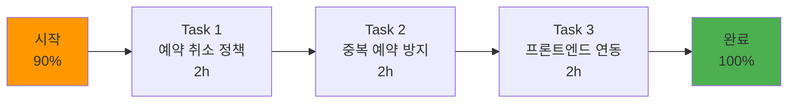
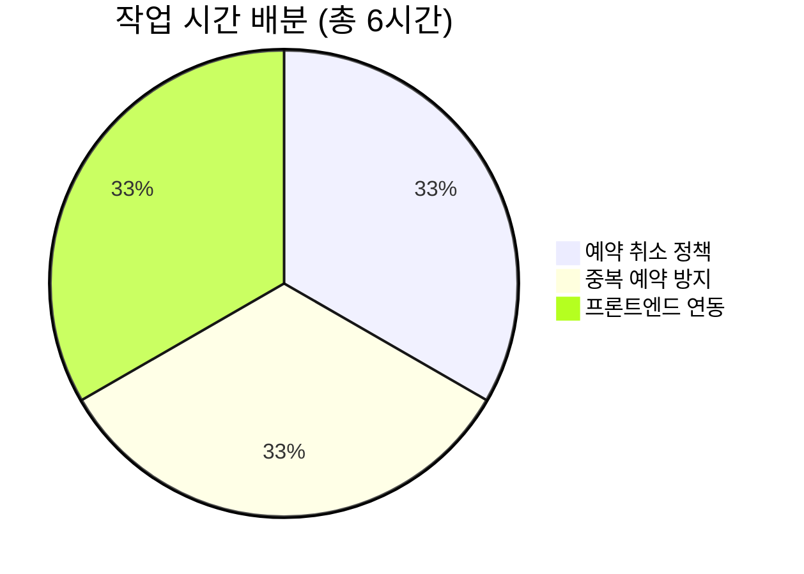

# 🚀 내일의 개발 계획 (2025년 11월 23일)

> **목표**: reservation-service 완성 (90% → 100%)
> **예상 소요**: 4-6시간
> **완료 후 진행률**: 82%

---

## 🎯 오늘의 목표

### reservation-service 완성 (10% 남음)



---

## ✅ 체크리스트

### 시작 전 준비
- [ ] IDE 실행 (IntelliJ IDEA / VS Code)
- [ ] 백엔드 서버 실행 확인
- [ ] 프론트엔드 개발 서버 실행
- [ ] Git 브랜치 생성: `git checkout -b feat/reservation-completion`

### 백엔드 작업 (4시간)
- [ ] Task 1-1: Reservation 엔티티 필드 추가 (30분)
- [ ] Task 1-2: 예약 취소 정책 로직 구현 (1.5시간)
- [ ] Task 2-1: Repository 쿼리 메서드 추가 (30분)
- [ ] Task 2-2: 중복 예약 방지 로직 구현 (1.5시간)

### 프론트엔드 작업 (2시간)
- [ ] Task 3-1: 예약 취소 API 호출 함수 (30분)
- [ ] Task 3-2: 취소 정책 안내 컴포넌트 (1시간)
- [ ] Task 3-3: 중복 예약 에러 처리 (30분)

### 테스트 및 마무리
- [ ] 백엔드 API 테스트 (Postman/Swagger)
- [ ] 프론트엔드 UI 테스트
- [ ] Git 커밋 및 푸시

---

## 📝 Task 1: 예약 취소 정책 구현 (2시간)

### Step 1-1: Reservation 엔티티 필드 추가 (30분)

**파일**: `backend/reservation-service/src/main/java/com/ddp/reservation/entity/Reservation.java`

**추가할 필드**:
```java
// 취소 관련 필드 추가
private BigDecimal cancellationFee; // 취소 수수료

@Column(length = 20)
private String cancellationPolicy; // 취소 정책 (24H_BEFORE, 24H_WITHIN)

// 기존 필드는 그대로 유지
```

**전체 Reservation 엔티티** (참고):
```java
@Entity
@Table(name = "reservations")
@Getter
@Setter
@Builder
@NoArgsConstructor(access = AccessLevel.PROTECTED)
@AllArgsConstructor(access = AccessLevel.PRIVATE)
public class Reservation {

    @Id
    @GeneratedValue(strategy = GenerationType.IDENTITY)
    private Long id;

    @Column(nullable = false)
    private Long userId; // 사용자 ID

    @Column(nullable = false)
    private Long companyId; // 업체 ID

    @Enumerated(EnumType.STRING)
    @Column(nullable = false)
    private ServiceType serviceType; // INSTALLATION, INSPECTION, MAINTENANCE, REPAIR

    @Column(nullable = false)
    private LocalDateTime requestedDate; // 희망 일시

    private LocalDateTime confirmedDate; // 확정 일시

    private LocalDateTime completedDate; // 완료 일시

    @Enumerated(EnumType.STRING)
    @Column(nullable = false)
    private ReservationStatus status; // PENDING, CONFIRMED, COMPLETED, CANCELLED, REJECTED

    @Column(length = 100)
    private String vehicleInfo; // 차량 정보

    @Column(length = 500)
    private String notes; // 요청 사항

    @Column(length = 500)
    private String cancelledReason; // 취소 사유

    private LocalDateTime cancelledAt; // 취소 시각

    // ⭐ 신규 추가 필드
    private BigDecimal cancellationFee; // 취소 수수료

    @Column(length = 20)
    private String cancellationPolicy; // 취소 정책

    @Column(length = 500)
    private String rejectedReason; // 거절 사유

    private LocalDateTime rejectedAt; // 거절 시각

    @Column(nullable = false)
    private LocalDateTime createdAt;

    private LocalDateTime updatedAt;

    @PrePersist
    protected void onCreate() {
        createdAt = LocalDateTime.now();
        updatedAt = LocalDateTime.now();
    }

    @PreUpdate
    protected void onUpdate() {
        updatedAt = LocalDateTime.now();
    }
}
```

---

### Step 1-2: 예약 취소 정책 로직 구현 (1.5시간)

**파일**: `backend/reservation-service/src/main/java/com/ddp/reservation/service/ReservationService.java`

#### 1. 기존 cancelReservation 메서드 수정

**기존 코드** (참고):
```java
@Transactional
public void cancelReservation(Long reservationId, Long userId) {
    Reservation reservation = reservationRepository.findById(reservationId)
        .orElseThrow(() -> new IllegalArgumentException("예약을 찾을 수 없습니다"));

    if (!reservation.getUserId().equals(userId)) {
        throw new IllegalArgumentException("본인의 예약만 취소할 수 있습니다");
    }

    if (reservation.getStatus() == ReservationStatus.COMPLETED) {
        throw new IllegalStateException("완료된 예약은 취소할 수 없습니다");
    }

    reservation.setStatus(ReservationStatus.CANCELLED);
    reservation.setCancelledAt(LocalDateTime.now());

    reservationRepository.save(reservation);
}
```

**⭐ 신규 코드** (취소 정책 추가):
```java
@Transactional
public CancelReservationResponse cancelReservation(
    Long reservationId,
    Long userId,
    String reason
) {
    // 1. 예약 조회 및 권한 확인
    Reservation reservation = reservationRepository.findById(reservationId)
        .orElseThrow(() -> new IllegalArgumentException("예약을 찾을 수 없습니다"));

    if (!reservation.getUserId().equals(userId)) {
        throw new IllegalArgumentException("본인의 예약만 취소할 수 있습니다");
    }

    // 2. 상태 확인
    if (reservation.getStatus() == ReservationStatus.COMPLETED) {
        throw new IllegalStateException("완료된 예약은 취소할 수 없습니다");
    }

    if (reservation.getStatus() == ReservationStatus.CANCELLED) {
        throw new IllegalStateException("이미 취소된 예약입니다");
    }

    // 3. 24시간 전/후 계산
    LocalDateTime now = LocalDateTime.now();
    LocalDateTime reservationTime = reservation.getRequestedDate();
    long hoursUntilReservation = ChronoUnit.HOURS.between(now, reservationTime);

    BigDecimal fee = BigDecimal.ZERO;
    String policy = "24H_BEFORE";

    // 4. 취소 수수료 계산
    if (hoursUntilReservation < 24) {
        // 24시간 이내 취소 - 취소 수수료 50%
        // 예약금이 없으면 기본 금액 (예: 50,000원)
        BigDecimal estimatedCost = reservation.getEstimatedCost() != null
            ? reservation.getEstimatedCost()
            : new BigDecimal("100000"); // 기본 설치 비용

        fee = estimatedCost.multiply(new BigDecimal("0.5"));
        policy = "24H_WITHIN";

        log.warn("24시간 이내 취소 - 취소 수수료 부과: {} 원", fee);
    } else {
        log.info("24시간 이전 취소 - 취소 수수료 없음");
    }

    // 5. 예약 취소 처리
    reservation.setStatus(ReservationStatus.CANCELLED);
    reservation.setCancelledReason(reason);
    reservation.setCancelledAt(now);
    reservation.setCancellationFee(fee);
    reservation.setCancellationPolicy(policy);

    reservationRepository.save(reservation);

    log.info("예약 취소 완료 - 예약 ID: {}, 취소 수수료: {}", reservationId, fee);

    // 6. 응답 생성
    return CancelReservationResponse.builder()
        .reservationId(reservationId)
        .cancellationFee(fee)
        .cancellationPolicy(policy)
        .message(policy.equals("24H_BEFORE")
            ? "취소 수수료 없이 예약이 취소되었습니다."
            : String.format("취소 수수료 %,d원이 부과됩니다.", fee.intValue()))
        .build();
}
```

---

#### 2. CancelReservationResponse DTO 생성

**파일**: `backend/reservation-service/src/main/java/com/ddp/reservation/dto/response/CancelReservationResponse.java`

```java
package com.ddp.reservation.dto.response;

import lombok.AllArgsConstructor;
import lombok.Builder;
import lombok.Getter;
import lombok.NoArgsConstructor;

import java.math.BigDecimal;

@Getter
@Builder
@NoArgsConstructor
@AllArgsConstructor
public class CancelReservationResponse {

    private Long reservationId;

    private BigDecimal cancellationFee; // 취소 수수료

    private String cancellationPolicy; // 24H_BEFORE or 24H_WITHIN

    private String message; // 안내 메시지
}
```

---

#### 3. ReservationController 수정

**파일**: `backend/reservation-service/src/main/java/com/ddp/reservation/controller/ReservationController.java`

**기존 DELETE 메서드 수정**:
```java
// 예약 취소
@DeleteMapping("/{id}")
public ResponseEntity<CancelReservationResponse> cancelReservation(
    @PathVariable Long id,
    @RequestBody CancelReservationRequest request,
    @AuthenticationPrincipal Long userId
) {
    CancelReservationResponse response = reservationService.cancelReservation(
        id,
        userId,
        request.getReason()
    );

    return ResponseEntity.ok(response);
}
```

---

#### 4. CancelReservationRequest DTO 생성

**파일**: `backend/reservation-service/src/main/java/com/ddp/reservation/dto/request/CancelReservationRequest.java`

```java
package com.ddp.reservation.dto.request;

import lombok.AllArgsConstructor;
import lombok.Getter;
import lombok.NoArgsConstructor;

@Getter
@NoArgsConstructor
@AllArgsConstructor
public class CancelReservationRequest {

    private String reason; // 취소 사유
}
```

---

#### 5. Reservation 엔티티에 estimatedCost 필드 추가 (선택)

**파일**: `backend/reservation-service/src/main/java/com/ddp/reservation/entity/Reservation.java`

```java
// 예상 비용 (예약 시 업체가 제시한 금액)
private BigDecimal estimatedCost;
```

---

## 📝 Task 2: 중복 예약 방지 (2시간)

### Step 2-1: Repository 쿼리 메서드 추가 (30분)

**파일**: `backend/reservation-service/src/main/java/com/ddp/reservation/repository/ReservationRepository.java`

**추가할 메서드**:
```java
package com.ddp.reservation.repository;

import com.ddp.reservation.entity.Reservation;
import com.ddp.reservation.entity.ReservationStatus;
import org.springframework.data.jpa.repository.JpaRepository;
import org.springframework.data.jpa.repository.Query;
import org.springframework.data.repository.query.Param;
import org.springframework.stereotype.Repository;

import java.time.LocalDateTime;
import java.util.List;

@Repository
public interface ReservationRepository extends JpaRepository<Reservation, Long> {

    // 기존 메서드들...

    // ⭐ 신규 추가: 중복 예약 조회
    @Query("SELECT r FROM Reservation r WHERE r.companyId = :companyId " +
           "AND r.requestedDate BETWEEN :startTime AND :endTime " +
           "AND r.status IN ('PENDING', 'CONFIRMED')")
    List<Reservation> findConflictingReservations(
        @Param("companyId") Long companyId,
        @Param("startTime") LocalDateTime startTime,
        @Param("endTime") LocalDateTime endTime
    );
}
```

---

### Step 2-2: 중복 예약 방지 로직 구현 (1.5시간)

**파일**: `backend/reservation-service/src/main/java/com/ddp/reservation/service/ReservationService.java`

#### 1. validateReservationTime 메서드 추가

```java
// 중복 예약 검증 (업체의 동일 시간대 예약 확인)
private void validateReservationTime(Long companyId, LocalDateTime requestedDate) {
    // ±2시간 범위 내에 다른 예약이 있는지 확인
    LocalDateTime startWindow = requestedDate.minusHours(2);
    LocalDateTime endWindow = requestedDate.plusHours(2);

    List<Reservation> conflicts = reservationRepository.findConflictingReservations(
        companyId,
        startWindow,
        endWindow
    );

    if (!conflicts.isEmpty()) {
        // 충돌하는 예약이 있으면 예외 발생
        Reservation conflictReservation = conflicts.get(0);

        throw new IllegalStateException(
            String.format(
                "해당 시간대(%s)에 이미 예약이 존재합니다. " +
                "다른 시간을 선택해주세요. (기존 예약: %s)",
                requestedDate.format(DateTimeFormatter.ofPattern("yyyy-MM-dd HH:mm")),
                conflictReservation.getRequestedDate()
                    .format(DateTimeFormatter.ofPattern("yyyy-MM-dd HH:mm"))
            )
        );
    }

    log.info("중복 예약 검증 완료 - 업체 ID: {}, 예약일: {}", companyId, requestedDate);
}
```

---

#### 2. createReservation 메서드 수정

**기존 코드**에 검증 로직 추가:

```java
@Transactional
public ReservationResponse createReservation(CreateReservationRequest request) {
    // 1. 사용자 정보 조회
    UserResponse user = authServiceClient.getUserById(request.getUserId());

    // 2. 업체 정보 조회
    CompanyResponse company = companyServiceClient.getCompanyById(request.getCompanyId());

    // ⭐ 3. 중복 예약 검증 (신규 추가)
    validateReservationTime(request.getCompanyId(), request.getRequestedDate());

    // 4. 예약 생성
    Reservation reservation = Reservation.builder()
        .userId(request.getUserId())
        .companyId(request.getCompanyId())
        .serviceType(request.getServiceType())
        .requestedDate(request.getRequestedDate())
        .vehicleInfo(request.getVehicleInfo())
        .notes(request.getNotes())
        .status(ReservationStatus.PENDING)
        .build();

    reservation = reservationRepository.save(reservation);

    log.info("예약 생성 완료 - 예약 ID: {}", reservation.getId());

    // 5. 응답 생성
    return ReservationResponse.builder()
        .reservationId(reservation.getId())
        .userId(reservation.getUserId())
        .userName(user.getName())
        .companyId(reservation.getCompanyId())
        .companyName(company.getName())
        .serviceType(reservation.getServiceType())
        .requestedDate(reservation.getRequestedDate())
        .status(reservation.getStatus())
        .vehicleInfo(reservation.getVehicleInfo())
        .notes(reservation.getNotes())
        .createdAt(reservation.getCreatedAt())
        .build();
}
```

---

#### 3. DateTimeFormatter import 추가

**파일 상단에 추가**:
```java
import java.time.format.DateTimeFormatter;
```

---

## 📝 Task 3: 프론트엔드 연동 (2시간)

### Step 3-1: 예약 취소 API 호출 함수 (30분)

**파일**: `frontend/src/features/reservation/api.ts`

#### 기존 API 함수 확인 및 수정

```typescript
// features/reservation/api.ts

import { apiClient } from '@/lib/axios';

export const reservationApi = {
  // 예약 목록 조회
  getList: async () => {
    const startTime = performance.now();
    console.log('API 호출 시작: 예약 목록 조회');

    try {
      const response = await apiClient.get('/reservations');

      const endTime = performance.now();
      console.log(
        `API 호출 완료: 예약 목록 조회 (${(endTime - startTime).toFixed(2)}ms)`
      );

      return response.data;
    } catch (error) {
      const endTime = performance.now();
      console.log(
        `API 호출 실패: 예약 목록 조회 (${(endTime - startTime).toFixed(2)}ms)`
      );
      throw error;
    }
  },

  // ⭐ 예약 취소 (수정)
  cancel: async (reservationId: number, reason: string) => {
    const startTime = performance.now();
    console.log('API 호출 시작: 예약 취소');

    try {
      const response = await apiClient.delete(`/reservations/${reservationId}`, {
        data: { reason },
      });

      const endTime = performance.now();
      console.log(
        `API 호출 완료: 예약 취소 (${(endTime - startTime).toFixed(2)}ms)`
      );

      return response.data; // CancelReservationResponse
    } catch (error) {
      const endTime = performance.now();
      console.log(
        `API 호출 실패: 예약 취소 (${(endTime - startTime).toFixed(2)}ms)`
      );
      throw error;
    }
  },

  // 예약 생성
  create: async (data: CreateReservationRequest) => {
    const startTime = performance.now();
    console.log('API 호출 시작: 예약 생성');

    try {
      const response = await apiClient.post('/reservations', data);

      const endTime = performance.now();
      console.log(
        `API 호출 완료: 예약 생성 (${(endTime - startTime).toFixed(2)}ms)`
      );

      return response.data;
    } catch (error) {
      const endTime = performance.now();
      console.log(
        `API 호출 실패: 예약 생성 (${(endTime - startTime).toFixed(2)}ms)`
      );
      throw error;
    }
  },
};
```

---

### Step 3-2: 취소 정책 안내 컴포넌트 (1시간)

**파일**: `frontend/src/app/user/reservations/page.tsx`

#### 1. 취소 다이얼로그 컴포넌트 추가

```typescript
'use client';

import { useState } from 'react';
import { Button } from '@/components/ui/button';
import {
  Dialog,
  DialogContent,
  DialogDescription,
  DialogFooter,
  DialogHeader,
  DialogTitle,
} from '@/components/ui/dialog';
import { Alert, AlertDescription, AlertTitle } from '@/components/ui/alert';
import { Textarea } from '@/components/ui/textarea';
import { AlertTriangle, Info } from 'lucide-react';

interface CancelDialogProps {
  reservation: Reservation;
  open: boolean;
  onOpenChange: (open: boolean) => void;
  onConfirm: (reason: string) => Promise<void>;
}

function CancelReservationDialog({
  reservation,
  open,
  onOpenChange,
  onConfirm,
}: CancelDialogProps) {
  const [reason, setReason] = useState('');
  const [loading, setLoading] = useState(false);

  // 예약일까지 남은 시간 계산
  const hoursUntilReservation = Math.floor(
    (new Date(reservation.requestedDate).getTime() - new Date().getTime()) /
      (1000 * 60 * 60)
  );

  const isWithin24Hours = hoursUntilReservation < 24;

  const handleConfirm = async () => {
    if (!reason.trim()) {
      alert('취소 사유를 입력해주세요');
      return;
    }

    setLoading(true);
    try {
      await onConfirm(reason);
      onOpenChange(false);
      setReason('');
    } catch (error) {
      console.error('예약 취소 실패:', error);
      alert('예약 취소 중 오류가 발생했습니다');
    } finally {
      setLoading(false);
    }
  };

  return (
    <Dialog open={open} onOpenChange={onOpenChange}>
      <DialogContent className="sm:max-w-[500px]">
        <DialogHeader>
          <DialogTitle>예약 취소</DialogTitle>
          <DialogDescription>
            예약을 취소하시겠습니까? 취소 후에는 복구할 수 없습니다.
          </DialogDescription>
        </DialogHeader>

        <div className="space-y-4">
          {/* 취소 정책 안내 */}
          <Alert variant={isWithin24Hours ? 'destructive' : 'default'}>
            {isWithin24Hours ? (
              <AlertTriangle className="h-4 w-4" />
            ) : (
              <Info className="h-4 w-4" />
            )}
            <AlertTitle>취소 정책 안내</AlertTitle>
            <AlertDescription>
              {isWithin24Hours ? (
                <>
                  <p className="font-semibold">
                    예약일까지 24시간 이내입니다.
                  </p>
                  <p className="mt-1">
                    취소 수수료(예약금의 50%)가 부과됩니다.
                  </p>
                  <p className="mt-1 text-sm">
                    남은 시간: 약 {hoursUntilReservation}시간
                  </p>
                </>
              ) : (
                <>
                  <p className="font-semibold">
                    예약일까지 24시간 이상 남았습니다.
                  </p>
                  <p className="mt-1">취소 수수료 없이 취소 가능합니다.</p>
                  <p className="mt-1 text-sm">
                    남은 시간: 약 {hoursUntilReservation}시간
                  </p>
                </>
              )}
            </AlertDescription>
          </Alert>

          {/* 취소 사유 입력 */}
          <div>
            <label
              htmlFor="reason"
              className="block text-sm font-medium mb-2"
            >
              취소 사유 <span className="text-red-500">*</span>
            </label>
            <Textarea
              id="reason"
              value={reason}
              onChange={(e) => setReason(e.target.value)}
              placeholder="취소 사유를 입력해주세요"
              rows={4}
              className="w-full"
            />
          </div>
        </div>

        <DialogFooter>
          <Button
            variant="outline"
            onClick={() => onOpenChange(false)}
            disabled={loading}
          >
            닫기
          </Button>
          <Button
            variant="destructive"
            onClick={handleConfirm}
            disabled={loading}
          >
            {loading ? '처리 중...' : '예약 취소'}
          </Button>
        </DialogFooter>
      </DialogContent>
    </Dialog>
  );
}
```

---

#### 2. 예약 목록 페이지에서 취소 다이얼로그 사용

```typescript
export default function UserReservationsPage() {
  const [reservations, setReservations] = useState<Reservation[]>([]);
  const [cancelDialogOpen, setCancelDialogOpen] = useState(false);
  const [selectedReservation, setSelectedReservation] =
    useState<Reservation | null>(null);

  // 예약 목록 조회
  useEffect(() => {
    loadReservations();
  }, []);

  const loadReservations = async () => {
    try {
      const data = await reservationApi.getList();
      setReservations(data);
    } catch (error) {
      console.error('예약 목록 조회 실패:', error);
    }
  };

  // 예약 취소 핸들러
  const handleCancelReservation = async (reason: string) => {
    if (!selectedReservation) return;

    try {
      const response = await reservationApi.cancel(
        selectedReservation.id,
        reason
      );

      // 성공 메시지 표시
      alert(response.message);

      // 취소 수수료 안내
      if (response.cancellationFee > 0) {
        alert(
          `취소 수수료 ${response.cancellationFee.toLocaleString()}원이 부과됩니다.`
        );
      }

      // 예약 목록 새로고침
      await loadReservations();
    } catch (error: any) {
      console.error('예약 취소 실패:', error);
      throw error;
    }
  };

  return (
    <div>
      <h1>내 예약</h1>

      {/* 예약 목록 */}
      {reservations.map((reservation) => (
        <div key={reservation.id}>
          {/* 예약 정보 표시 */}
          <p>{reservation.companyName}</p>
          <p>{reservation.requestedDate}</p>
          <p>{reservation.status}</p>

          {/* 취소 버튼 */}
          {(reservation.status === 'PENDING' ||
            reservation.status === 'CONFIRMED') && (
            <Button
              variant="destructive"
              onClick={() => {
                setSelectedReservation(reservation);
                setCancelDialogOpen(true);
              }}
            >
              예약 취소
            </Button>
          )}
        </div>
      ))}

      {/* 취소 다이얼로그 */}
      {selectedReservation && (
        <CancelReservationDialog
          reservation={selectedReservation}
          open={cancelDialogOpen}
          onOpenChange={setCancelDialogOpen}
          onConfirm={handleCancelReservation}
        />
      )}
    </div>
  );
}
```

---

### Step 3-3: 중복 예약 에러 처리 (30분)

**파일**: `frontend/src/app/user/reservations/new/page.tsx`

#### 예약 생성 시 에러 처리

```typescript
// 예약 생성 핸들러
const handleCreateReservation = async (data: CreateReservationRequest) => {
  try {
    await reservationApi.create(data);

    alert('예약이 성공적으로 생성되었습니다');
    router.push('/user/reservations');
  } catch (error: any) {
    console.error('예약 생성 실패:', error);

    // 중복 예약 에러 처리
    if (error.response?.status === 400) {
      const errorMessage = error.response?.data?.message || '예약에 실패했습니다';

      if (errorMessage.includes('이미 예약이 존재합니다')) {
        alert(
          '선택하신 시간대에 이미 다른 예약이 존재합니다.\n다른 시간을 선택해주세요.'
        );
      } else {
        alert(errorMessage);
      }
    } else {
      alert('예약 생성 중 오류가 발생했습니다');
    }
  }
};
```

---

## 🧪 테스트 계획

### 백엔드 API 테스트

#### 1. 예약 취소 정책 테스트

**Postman/Swagger**:

**24시간 이전 취소** (수수료 없음):
```http
DELETE http://localhost:8080/api/v1/reservations/1
Content-Type: application/json

{
  "reason": "개인 사정으로 취소합니다"
}
```

**예상 응답**:
```json
{
  "reservationId": 1,
  "cancellationFee": 0,
  "cancellationPolicy": "24H_BEFORE",
  "message": "취소 수수료 없이 예약이 취소되었습니다."
}
```

---

**24시간 이내 취소** (수수료 50%):
```http
DELETE http://localhost:8080/api/v1/reservations/2
Content-Type: application/json

{
  "reason": "급한 일이 생겨서 취소합니다"
}
```

**예상 응답**:
```json
{
  "reservationId": 2,
  "cancellationFee": 50000,
  "cancellationPolicy": "24H_WITHIN",
  "message": "취소 수수료 50,000원이 부과됩니다."
}
```

---

#### 2. 중복 예약 방지 테스트

**시나리오**: 동일 업체, 동일 시간대 예약 시도

**예약 1** (성공):
```http
POST http://localhost:8080/api/v1/reservations
Content-Type: application/json

{
  "userId": 1,
  "companyId": 5,
  "serviceType": "INSTALLATION",
  "requestedDate": "2025-11-25T14:00:00",
  "vehicleInfo": "12가3456",
  "notes": "주차 가능"
}
```

**예약 2** (실패 - 중복):
```http
POST http://localhost:8080/api/v1/reservations
Content-Type: application/json

{
  "userId": 2,
  "companyId": 5,
  "serviceType": "INSTALLATION",
  "requestedDate": "2025-11-25T15:00:00",
  "vehicleInfo": "78나9012",
  "notes": "빠른 설치 부탁드립니다"
}
```

**예상 응답** (400 Bad Request):
```json
{
  "status": 400,
  "message": "해당 시간대(2025-11-25 15:00)에 이미 예약이 존재합니다. 다른 시간을 선택해주세요. (기존 예약: 2025-11-25 14:00)"
}
```

---

### 프론트엔드 UI 테스트

#### 1. 취소 정책 안내 테스트

1. 예약 목록에서 "예약 취소" 버튼 클릭
2. 취소 다이얼로그 표시 확인
3. 24시간 전/후에 따라 안내 메시지 다르게 표시되는지 확인
4. 취소 사유 입력 후 "예약 취소" 버튼 클릭
5. 성공 메시지 표시 확인
6. 예약 목록 새로고침 확인

#### 2. 중복 예약 에러 메시지 테스트

1. 예약 생성 폼에서 이미 예약된 시간대 선택
2. "예약하기" 버튼 클릭
3. 에러 메시지 "선택하신 시간대에 이미 다른 예약이 존재합니다" 표시 확인
4. 다른 시간대 선택 후 재시도

---

## 📦 Git 커밋

### 커밋 메시지 템플릿

```bash
# 1. 변경 사항 확인
git status

# 2. 파일 추가
git add backend/reservation-service/
git add frontend/src/features/reservation/
git add frontend/src/app/user/reservations/

# 3. 커밋
git commit -m "feat: reservation-service 완성

- 예약 취소 정책 구현 (24시간 전/후 차등 수수료)
- 중복 예약 방지 로직 추가 (±2시간 범위)
- 프론트엔드 취소 다이얼로그 및 에러 처리

주요 변경사항:
- Reservation 엔티티: cancellationFee, cancellationPolicy 필드 추가
- ReservationService: cancelReservation 메서드 취소 정책 로직 추가
- ReservationRepository: findConflictingReservations 쿼리 메서드 추가
- ReservationService: validateReservationTime 중복 검증 로직 추가
- 프론트엔드: CancelReservationDialog 컴포넌트 생성
- 프론트엔드: 중복 예약 에러 처리

Generated with Claude Code

Co-Authored-By: Claude <noreply@anthropic.com>"

# 4. 푸시
git push origin feat/reservation-completion
```

---

## ⏱️ 시간 배분



| 시간 | 작업 | 상세 |
|------|------|------|
| 09:00-09:30 | 환경 설정 | 서버 실행, 브랜치 생성 |
| 09:30-12:00 | 백엔드 개발 | 취소 정책 + 중복 방지 |
| 12:00-13:00 | 점심 휴식 | - |
| 13:00-15:00 | 프론트엔드 개발 | 취소 다이얼로그 + 에러 처리 |
| 15:00-16:00 | 테스트 | API 테스트 + UI 테스트 |
| 16:00-16:30 | 마무리 | Git 커밋, 문서 업데이트 |

---

## ✅ 완료 후 확인사항

- [ ] 백엔드 API 정상 동작 확인 (Postman)
- [ ] 프론트엔드 UI 정상 동작 확인
- [ ] 24시간 전/후 취소 수수료 계산 정확성 확인
- [ ] 중복 예약 방지 로직 동작 확인
- [ ] Git 커밋 및 푸시 완료
- [ ] reservation-service 진행률: 90% → 100% ✅
- [ ] 전체 프로젝트 진행률: 80% → 82% ✅

---

## 🎉 완료 후 다음 단계

**내일 (11/24)**: notification-service 구축 시작
- Spring Boot 프로젝트 생성
- Eureka Client 설정
- Notification 엔티티 생성

**예상 진행률**:
- 11/23 (오늘): 82%
- 11/24 (내일): 84%
- 11/30 (1주 후): 90%
- 12/20 (완료): 100%

---

**문서 생성일**: 2025년 11월 22일
**대상 작업일**: 2025년 11월 23일
**작성자**: DDP 개발팀

**화이팅! 🚀**
