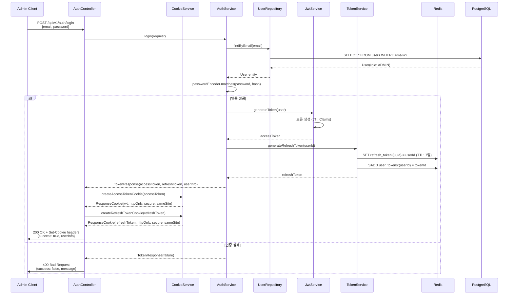
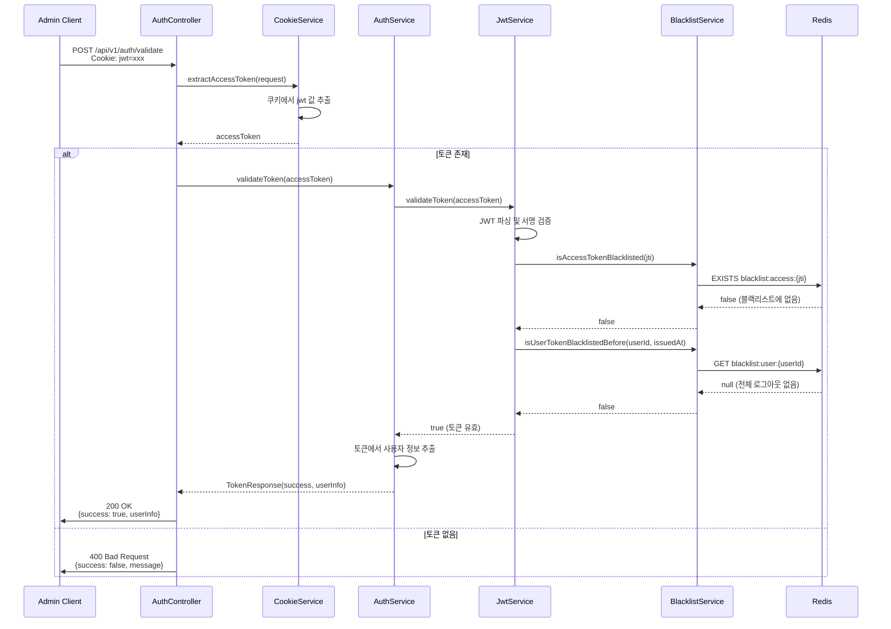
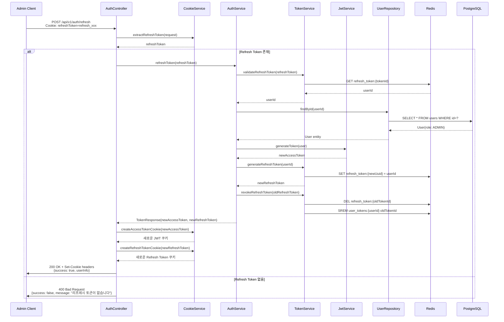
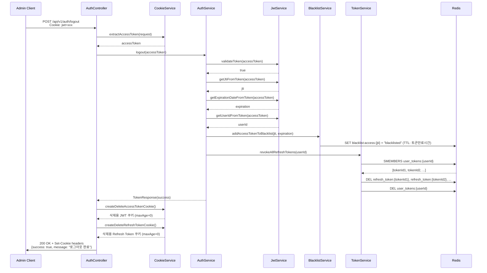
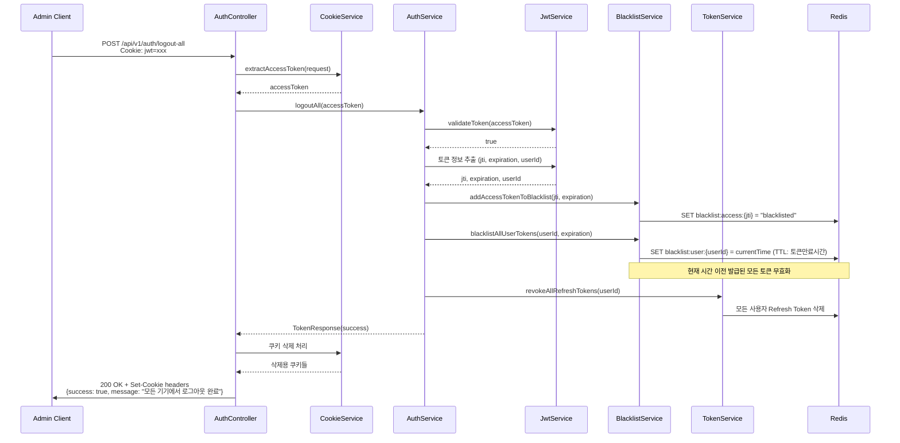

# Admin JWT 인증 시스템 아키텍처 문서

## 시스템 개요

이 시스템은 httpOnly 쿠키 기반의 JWT 인증을 사용하여 Admin 사용자의 로그인, 토큰 관리, 로그아웃을 처리합니다. Redis를 활용한 토큰 저장소와 블랙리스트 관리로 보안을 강화했습니다.

### 주요 컴포넌트

- **AuthController**: HTTP 요청 처리 및 쿠키 관리
- **AuthService**: 인증 비즈니스 로직 처리
- **JwtService**: JWT 토큰 생성/검증
- **TokenService**: Refresh Token Redis 관리
- **BlacklistService**: 토큰 무효화 관리
- **CookieService**: httpOnly 쿠키 생성/관리
- **Redis**: 토큰 저장소 및 블랙리스트
- **PostgreSQL**: 사용자 정보 저장

## 1. Admin 로그인 플로우



### 주요 단계 설명

1. **사용자 인증**: Admin 계정의 이메일과 비밀번호 검증
2. **토큰 생성**: JWT Access Token과 UUID 기반 Refresh Token 생성
3. **Redis 저장**: Refresh Token을 Redis에 7일 TTL로 저장
4. **쿠키 설정**: httpOnly, Secure, SameSite 속성을 가진 쿠키로 토큰 전송
5. **응답**: 토큰은 쿠키로 전송하고 사용자 정보만 응답 body에 포함

## 2. Admin API 요청 시 토큰 검증



### 검증 과정

1. **쿠키 추출**: httpOnly 쿠키에서 JWT 토큰 추출
2. **JWT 검증**: 서명, 만료시간, 형식 검증
3. **블랙리스트 확인**: 개별 토큰 및 사용자별 전체 무효화 여부 확인
4. **사용자 정보 반환**: 토큰에서 추출한 사용자 정보 응답

## 3. Admin 토큰 갱신



### 토큰 로테이션 특징

1. **Refresh Token 검증**: Redis에서 토큰 유효성 확인
2. **새 토큰 생성**: 새로운 Access Token과 Refresh Token 발급
3. **기존 토큰 무효화**: 사용된 Refresh Token 즉시 삭제
4. **쿠키 업데이트**: 새로운 토큰들을 httpOnly 쿠키로 설정

## 4. Admin 로그아웃



### 로그아웃 처리

1. **토큰 블랙리스트 등록**: 현재 Access Token의 JTI를 블랙리스트에 추가
2. **Refresh Token 삭제**: 사용자의 모든 Refresh Token Redis에서 제거
3. **쿠키 삭제**: maxAge=0으로 설정한 쿠키 전송하여 브라우저에서 제거

## 5. Admin 전체 로그아웃 (모든 기기)



### 전체 로그아웃 특징

1. **현재 토큰 블랙리스트**: 요청한 토큰을 블랙리스트에 추가
2. **시간 기반 무효화**: 현재 시간 이전에 발급된 모든 토큰 무효화
3. **전체 Refresh Token 삭제**: 사용자의 모든 Refresh Token 제거
4. **모든 기기 로그아웃**: 다른 브라우저/앱에서도 자동 로그아웃

## 보안 특징

### 1. httpOnly 쿠키 사용

```javascript
// 쿠키 설정 예시
ResponseCookie.from("jwt", accessToken)
    .httpOnly(true)          // JavaScript 접근 차단
    .secure(true)            // HTTPS에서만 전송
    .sameSite("Strict")      // CSRF 공격 방지
    .path("/")
    .maxAge(3600)            // 1시간
    .build();
```

**보안 효과**:
- XSS 공격으로부터 토큰 보호
- JavaScript에서 접근 불가
- CSRF 공격 방지

### 2. 토큰 로테이션

- Refresh Token 사용 시마다 새로운 토큰 발급
- 기존 토큰 즉시 무효화
- 토큰 탈취 시 피해 최소화

### 3. 블랙리스트 관리

```redis
# Access Token 블랙리스트
SET blacklist:access:{jti} "blacklisted" EX {토큰만료시간}

# 사용자별 전체 무효화
SET blacklist:user:{userId} {현재시간} EX {토큰만료시간}

# Refresh Token 블랙리스트
SET blacklist:refresh:{tokenId} "blacklisted" EX 604800
```

**특징**:
- TTL 설정으로 메모리 효율성 확보
- 빠른 블랙리스트 조회
- 사용자별 일괄 무효화 지원

### 4. Redis 활용

#### Refresh Token 저장
```redis
# Refresh Token 저장 (7일 TTL)
SET refresh_token:{uuid} {userId} EX 604800

# 사용자별 토큰 목록
SADD user_tokens:{userId} {tokenId}
EXPIRE user_tokens:{userId} 604800
```

#### 성능 최적화
- 인메모리 저장으로 빠른 조회
- TTL 자동 만료로 가비지 컬렉션 불필요
- Set 자료구조로 효율적인 토큰 관리

## API 엔드포인트

### 인증 관련

| Method | Endpoint | Description | Cookie Required |
|--------|----------|-------------|-----------------|
| POST | `/api/v1/auth/login` | Admin 로그인 | - |
| POST | `/api/v1/auth/validate` | 토큰 검증 | jwt |
| POST | `/api/v1/auth/refresh` | 토큰 갱신 | refreshToken |
| POST | `/api/v1/auth/logout` | 로그아웃 | jwt |
| POST | `/api/v1/auth/logout-all` | 전체 로그아웃 | jwt |

### 요청/응답 예시

#### 로그인 요청
```json
POST /api/v1/auth/login
{
  "email": "admin@example.com",
  "password": "admin123"
}
```

#### 로그인 응답
```http
HTTP/1.1 200 OK
Set-Cookie: jwt=eyJhbGciOiJIUzUxMiJ9...; HttpOnly; Secure; SameSite=Strict; Path=/; Max-Age=3600
Set-Cookie: refreshToken=refresh_550e8400-e29b-41d4...; HttpOnly; Secure; SameSite=Strict; Path=/; Max-Age=604800

{
  "success": true,
  "message": "로그인 성공",
  "userId": 1,
  "email": "admin@example.com",
  "name": "관리자",
  "role": "ADMIN"
}
```

## 설정 관리

### JWT 설정 (`auth-service.yml`)

```yaml
jwt:
  secret: ${JWT_SECRET:myDevelopmentSecretKeyForDDPProject32Chars}
  access-token-expiration: 3600  # 1시간
  refresh-token-expiration: 604800  # 7일
  cookie:
    # Access Token 쿠키 설정
    name: jwt
    max-age: 3600
    # Refresh Token 쿠키 설정
    refresh-name: refreshToken
    refresh-max-age: 604800
    # 보안 설정
    secure: ${JWT_COOKIE_SECURE:false}
    http-only: ${JWT_COOKIE_HTTP_ONLY:true}
    same-site: ${JWT_COOKIE_SAME_SITE:strict}
```

### Redis 설정

```yaml
spring:
  data:
    redis:
      url: ${REDIS_URL:redis://:1234@localhost:6379}
      timeout: ${REDIS_TIMEOUT:2000ms}
      database: ${REDIS_DATABASE:0}
```

## 모니터링 및 로깅

### 보안 이벤트 로깅

모든 인증 관련 작업은 구조화된 로그로 기록됩니다:

```
2024-01-15 10:30:45.123 INFO  - API 호출 시작: 사용자 로그인 - 이메일: admin@example.com
2024-01-15 10:30:45.156 INFO  - API 호출 완료: 사용자 로그인 - 사용자 ID: 1, 액세스+리프레시 토큰 발급 완료 (33ms)
2024-01-15 10:35:22.789 INFO  - API 호출 시작: 토큰 갱신
2024-01-15 10:35:22.801 INFO  - API 호출 완료: 토큰 갱신 - 사용자 ID: 1 (12ms)
```

### 성능 모니터링

- 각 API 호출의 응답 시간 측정
- Redis 연결 상태 모니터링
- 블랙리스트 크기 추적

## 확장 가능성

### 1. 다중 Admin 역할 지원
```java
public enum AdminRole {
    SUPER_ADMIN,    // 최고 관리자
    SYSTEM_ADMIN,   // 시스템 관리자
    USER_ADMIN      // 사용자 관리자
}
```

### 2. 세션 제한
```java
// 사용자당 최대 동시 세션 수 제한
private static final int MAX_CONCURRENT_SESSIONS = 3;
```

### 3. 지리적 위치 기반 보안
```java
// 비정상적인 위치에서의 로그인 감지
public boolean isLoginFromSuspiciousLocation(String clientIP, Long userId);
```

이 시스템은 엔터프라이즈급 보안 수준을 제공하며, Admin 사용자의 안전한 인증과 권한 관리를 보장합니다.